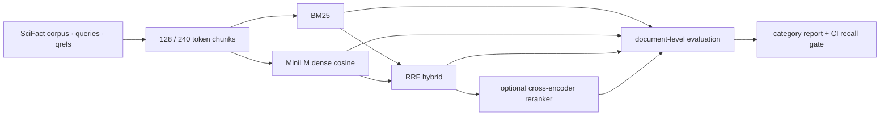

# WO-01 · 검색 평가 하네스
> 개인 프로젝트 · 대응 직군: AI 엔지니어 / 데이터 사이언티스트 · 데이터: BEIR SciFact (claims/annotations CC BY 4.0, abstracts ODC-By 1.0)

## 문제 정의

RAG 검색 설정을 바꿨을 때 개선 여부를 감이 아니라 반복 가능한 수치로 판단한다. 검색 실패를 생성 실패와 분리하기 위해 이 프로젝트는 문서 검색만 실행하고, 동일한 SciFact 골든셋에서 Recall@10, MRR, nDCG@10을 측정한다.

## 가설

1. Dense 검색은 표현이 다른 과학 주장과 근거를 연결해 BM25보다 높은 recall을 낼 것이다.
2. BM25와 Dense를 RRF로 결합하면 두 검색기의 상호 보완으로 단독 Dense보다 좋아질 것이다.
3. 짧은 청크와 cross-encoder 리랭킹은 품질을 더 높이지만 계산 비용이 증가할 것이다.

## 접근 — 시도 순서

**1차 시도 (BM25 단독)**: 어휘 일치 기반 검색만으로 기준선을 잡았다. Recall@10 0.7575로, 표현이 다른 과학 주장-근거 쌍을 연결하지 못하는 사례가 다수 보였다 — 가설 1과 일치.

**2차 시도 (Dense 단독)**: MiniLM 임베딩으로 전환하니 Recall@10이 0.8082로 올랐다. 다만 숫자·비교 표현이 섞인 쿼리에서는 BM25보다 오히려 낮았다 — 두 검색기가 서로 다른 실패를 가진다는 신호.

**3차 시도 (Hybrid RRF)**: 가설 2를 검증하기 위해 두 순위를 RRF로 결합했다. Recall@10 0.8244로 Dense 단독 대비 1.63%p 개선, 카테고리별로도 고르게 향상 — 두 검색기의 상호 보완을 확인.

**4차 시도 (청크 크기 비교)**: 작업지시서 예시였던 512-token 청크는 MiniLM의 256-token 입력 한도를 초과했다. 모델 한도 안에서 128과 240을 비교한 결과 128-token이 세 지표 모두 더 높아 이를 채택했다.

**5차 시도 (리랭커 추가)**: 가설 3을 검증하기 위해 cross-encoder를 추가했다. Recall@10은 0.79%p 올랐지만 MRR은 0.12%p 내려갔고, 300개 쿼리에 45.96초가 추가로 들었다 — recall과 지연시간의 트레이드오프를 확인하고, 기본 경로에서는 제외하기로 결정.

## 데이터

- 공식 BEIR SciFact test split: 문서 5,183개, 판정 쿼리 300개, 관련 문서 쌍 339개
- 다운로드: `python data/download.py`
- 무결성: BEIR 공개 MD5 `5f7d1de60b170fc8027bb7898e2efca1` 검증 후 압축 해제
- 라이선스: SciFact의 claims/evidence annotations는 CC BY 4.0, corpus abstracts는 ODC-By 1.0이다. 자세한 출처와 다운로드 방법은 [`data/README.md`](data/README.md)에 기록했다.
- 원본 데이터와 임베딩 캐시는 Git에 포함하지 않는다.

SciFact가 검색 카테고리를 제공하지 않으므로, 쿼리 문장 형태를 상호 배타적인 세 그룹으로 나눴다. `negation`을 먼저 판별하고, 숫자나 비교 표현이 있으면 `numeric_or_comparative`, 나머지는 `other`로 분류한다. 이는 도메인 정답 라벨이 아니라 오류를 읽기 위한 분석용 휴리스틱이다.

## 파이프라인



- 각 청크 점수에서 부모 문서의 최고 점수를 사용해 문서 순위로 복원한다. qrels가 문서 단위이기 때문이다.
- Dense 모델은 `sentence-transformers/all-MiniLM-L6-v2`, 리랭커는 `cross-encoder/ms-marco-MiniLM-L-6-v2`다.
- Hybrid는 BM25와 Dense의 문서 순위를 RRF(`k=60`)로 합친다.
- Recall과 nDCG는 상위 10개 문서, MRR은 보존한 상위 50개 문서에서 계산한다. 모든 결과는 쿼리 단위 macro average다.

로컬 실행:

```bash
python3.11 -m venv .venv
source .venv/bin/activate
pip install -r requirements.txt
python run.py --mode full
python -m src.report hybrid_128
python run.py --mode gate
pytest -q
```

Docker Compose에서는 `docker compose run --rm retrieval-eval` 한 명령으로 기준선 재계산과 테스트를 실행한다.

## 결과 (Ship Gate 표)

전체 결과 JSON과 카테고리별 표는 [`results/experiments.json`](results/experiments.json), [`results/table.md`](results/table.md)에 있다.

| Ship Gate | 목표 | 실제 |
|---|---|---|
| 청크 크기 비교 | 2개 이상 | 128 vs 240 token 완료 |
| Dense vs Hybrid | Recall@10 / MRR / nDCG@10 비교 | 3개 지표 비교 완료 |
| 리랭커 on/off | 동일 후보군 비교 | `hybrid_128` on/off 완료 |
| 카테고리별 지표 | 모든 판정 쿼리 포함 | 30 + 78 + 192 = 300개 |
| CI 회귀 게이트 | Recall@10 1%p 초과 하락 차단 | 0.8244 통과, 0.8000 의도적 실패 |
| 에러 분석 | 실패 쿼리 5개 | 서로 다른 실패 유형 5개 분석 |

핵심 비교:

| 비교 목적 | 설정 | Recall@10 | MRR | nDCG@10 |
|---|---|---:|---:|---:|
| sparse 기준 | BM25 · 128 | 0.7575 | 0.5942 | 0.6261 |
| dense 단독 | Dense · 128 | 0.8082 | 0.6448 | 0.6767 |
| 선택 설정 | Hybrid · 128 | **0.8244** | **0.6647** | **0.6942** |
| 청크 크기 | Hybrid · 240 | 0.8138 | 0.6567 | 0.6849 |
| 리랭커 사용 | Hybrid · 128 · rerank | **0.8323** | 0.6635 | **0.6946** |

선택한 `hybrid_128`의 카테고리별 결과:

| 카테고리 | n | Recall@10 | MRR | nDCG@10 |
|---|---:|---:|---:|---:|
| negation | 30 | 0.8500 | 0.6797 | 0.7153 |
| numeric_or_comparative | 78 | 0.8165 | 0.6979 | 0.7092 |
| other | 192 | 0.8237 | 0.6488 | 0.6849 |
| 전체 | 300 | 0.8244 | 0.6647 | 0.6942 |

### 추천과 트레이드오프

기본 검색 설정으로 `hybrid_128`을 선택한다. 리랭커는 recall이 최우선인 오프라인 검색에만 선택적으로 켠다.

### CI 게이트

[`results/baseline.json`](results/baseline.json)의 `hybrid_128` Recall@10 0.8244를 기준으로, 후보가 0.8144 아래로 내려가면 PR 테스트가 실패한다. 정상 재계산은 7개 테스트를 통과했고, [`tests/fixtures/bad_candidate.json`](tests/fixtures/bad_candidate.json)을 넣은 시연은 `0.8000 < 0.8144`로 실패했다. 실제 로그와 재현 명령은 [`results/gate_demo.md`](results/gate_demo.md)에 있다.

### 실패 쿼리 5개

선택 설정에서 Recall@10이 불완전한 쿼리는 58개다. 그중 RRF가 좋은 dense hit을 10위 밖으로 민 사례, 부정·비교 의미를 놓친 사례, 긴 종합 논문과 짧은 주장 사이의 표현 불일치, 약어 오타, 숫자 중심 주장 등 5개를 [`results/error_analysis.md`](results/error_analysis.md)에 근거 문서 순위와 함께 분석했다.

## 측정 경계

카테고리는 SciFact 공식 메타데이터가 아닌 분석용 휴리스틱이다. SciFact 300개 쿼리는 통계적 유의성 검정을 하지 않았다. Dense 모델·리랭커는 일반 영어 검색 모델이며 과학·의생명 도메인 특화 모델이 아니다. 기록한 지연시간은 embedding cache가 준비된 warm 상태 기준이다. 이 프로젝트는 retrieval만 평가하며, generation 품질은 WO-02에서 다룬다.

**다음 단계**: 도메인 특화 임베딩·리랭커 교체 시 재평가, adaptive fusion weight 실험.

## 개발 방식 (AI 활용 구분)

| 직접 작성한 것 | Codex가 생성한 것 |
|---|---|
| 프로젝트 목표, 기술 제약, Ship Gate, 설정별 선택 근거 | 검색기·평가·리포트·회귀 게이트 구현, 실험 실행, 테스트, 문서 초안 |

## 관련 개념

- BM25: 희소 어휘 일치 기반 검색
- Dense retrieval: 문장 임베딩 cosine similarity 기반 검색
- Reciprocal Rank Fusion: 점수 척도가 다른 두 순위를 rank 기반으로 결합
- Recall@10: 관련 문서 중 상위 10개 안에 찾은 비율
- MRR: 첫 관련 문서 순위의 역수
- nDCG@10: 관련도와 순서 할인을 함께 반영한 상위 10개 품질
- Regression gate: 기준 성능보다 허용 폭 이상 떨어지는 변경을 CI에서 차단

## English Technical Summary

This project implements a reproducible retrieval evaluation harness on the official BEIR SciFact test split. It compares chunked BM25, MiniLM dense retrieval, Reciprocal Rank Fusion, and cross-encoder reranking with document-level Recall@10, MRR, and nDCG@10. The selected 128-token hybrid retriever reached 0.8244 Recall@10, 0.6647 MRR, and 0.6942 nDCG@10 across 300 judged queries. A pull-request gate recomputes the selected configuration and fails when Recall@10 drops by more than one percentage point from the committed baseline.
