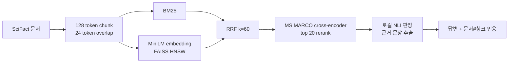

# WO-02 · 하이브리드 검색 기반 근거 인용 RAG
> 개인 프로젝트 · 대응 직군: AI 엔지니어 / 검색 ML · 데이터: BEIR SciFact (claims/annotations: CC BY 4.0, abstracts: ODC-By 1.0)

## 문제 정의

키워드 검색은 정확한 용어와 숫자에 강하지만 의미가 비슷한 표현을 놓치고, dense 검색은 의미 유사성을 찾지만 희귀어와 정확 일치에 약하다. 이 프로젝트는 같은 문서 청크 위에 BM25와 FAISS HNSW dense 인덱스를 만들고, RRF와 cross-encoder 리랭킹을 단계적으로 적용해 검색 성능 변화를 측정한다. 검색된 근거로 로컬 NLI 답변을 만들고 모든 답변에 `[문서ID#청크ID]` 인용을 붙여 검색 품질과 생성 품질을 별도로 평가한다.

## 가설

1. BM25와 dense 검색을 RRF로 결합하면 서로 다른 실패를 보완해 BM25보다 Recall@10과 nDCG@10이 높아진다.
2. cross-encoder가 상위 후보를 질의와 함께 읽으면 정답 문서의 순위가 더 올라간다.
3. 답변을 근거 문장의 추출형 판정으로 제한하면 모든 답변에 검증 가능한 청크 인용을 남길 수 있다.

## 데이터

- **검색 평가**: [BEIR SciFact](https://github.com/beir-cellar/beir) test qrels, 5,183개 문서와 300개 질의
- **생성 평가**: SciFact의 사람 라벨이 있는 주장 30개. 사실 조회, 비교, 수치·계산형을 각 10개씩 고정 선택
- **라이선스**: SciFact의 claims/annotations는 CC BY 4.0, 논문 abstracts는 ODC-By 1.0
- **원본 데이터 관리**: 원본과 모델 캐시는 Git에 넣지 않는다. [`data/download.py`](data/download.py)가 압축 파일의 MD5를 확인하고 안전하게 압축을 푼다.

```bash
python3.11 -m venv .venv
source .venv/bin/activate
pip install -r requirements.txt
python run.py
pytest -q
```

첫 실행에는 Hugging Face 모델 다운로드가 필요하다. API 키나 외부 LLM 서비스는 사용하지 않는다.

## 접근 / 파이프라인



- WO-01에서 가장 좋았던 **128-token 청크**를 재사용하고 24-token overlap을 둔다.
- BM25와 `all-MiniLM-L6-v2` dense 검색이 각각 상위 50개 문서를 반환한다.
- RRF(`k=60`)가 점수 정규화 없이 두 순위를 합친다.
- `ms-marco-MiniLM-L-6-v2`가 상위 20개 후보를 재정렬한다.
- `nli-deberta-v3-xsmall`이 최상위 문서에서 SUPPORT/CONTRADICT 판정과 근거 문장을 고른다.
- 검색은 300개 전체 질의로, 생성은 유형별 10개씩 총 30개로 평가한다.

Docker Compose로 같은 과정을 재현할 수 있다.

```bash
docker compose run --rm hybrid-rag
```

## 결과 (Ship Gate 표)

### 검색 단계별 비교

| 단계 | 질의 수 | Recall@10 | MRR | nDCG@10 |
|---|---:|---:|---:|---:|
| BM25 | 300 | 0.7575 | 0.5942 | 0.6261 |
| Dense HNSW | 300 | 0.8015 | 0.6417 | 0.6728 |
| Hybrid RRF | 300 | **0.8244** | 0.6597 | **0.6905** |
| Hybrid + reranker | 300 | 0.8096 | **0.6605** | 0.6843 |

| Ship Gate 지표 | 목표 | 실제 |
|---|---|---:|
| Hybrid+rerank Recall@10 개선폭 | BM25보다 개선 | **+5.21%p** |
| Hybrid+rerank nDCG@10 개선폭 | BM25보다 개선 | **+5.82%p** |
| 답변의 출처 청크 인용 포함률 | 100% | **100% (30/30)** |
| faithfulness 분리 보고 | retrieval과 별도 | **0.5667** |
| 검색 실패와 생성 실패 분리 | 별도 집계 | **53/300, 13/30** |

RRF가 두 검색기의 상호 보완 효과를 가장 잘 냈다. Hybrid+rerank도 BM25 기준 Ship Gate는 통과했지만, RRF 단독과 비교하면 Recall@10은 1.49%p, nDCG@10은 0.62%p 낮아졌다. SciFact 운영 기본값으로는 **Hybrid RRF**를 선택하고, 리랭커는 과학 도메인 모델로 교체한 뒤 다시 평가하는 것이 합리적이다.

### 생성 품질

| 지표 | 값 | 정의 |
|---|---:|---|
| Citation coverage | 1.0000 | 답변에 `[문서ID#청크ID]`가 있는 비율 |
| Citation correctness | 0.8333 | 인용 문서가 사람 라벨의 정답 문서인 비율 |
| Extractive grounding | 1.0000 | 답변 근거 문장이 인용 청크에 실제 존재하는 비율 |
| Faithfulness | 0.5667 | 추출 근거, 정답 문서 인용, 사람 라벨과 같은 판정을 모두 만족한 비율 |
| Answer relevance cosine | 0.6261 | 질문과 답변 MiniLM 임베딩의 평균 cosine |
| Verdict accuracy | 0.6333 | SUPPORT/CONTRADICT 판정 정확도 |

인용 답변 예시:

> **Claim:** ALDH1 expression is associated with poorer prognosis in breast cancer.  
> **Answer:** SUPPORT. in a series of 577 breast carcinomas, expression of aldh1 detected by immunostaining correlated with poor prognosis. **[45638119#c1]**

전체 수치는 [`results/experiments.json`](results/experiments.json), 답변 30개는 [`results/answers.json`](results/answers.json), 읽기 쉬운 결과표는 [`results/report.md`](results/report.md)에 저장했다.

## 시행착오와 해결

- 처음에는 리랭킹 상위 5개 문서의 문장을 모두 NLI에 넣었다. 로컬 NLI가 비정답 문장의 높은 점수를 과신하면서 잘못된 문서를 인용하는 경우가 늘어 생성 컨텍스트를 1위 문서로 제한했다. 인용 정확도는 좋아졌지만 정답이 2위 이하일 때의 생성 실패가 남았다.
- 리랭커를 추가하면 모든 검색 지표가 좋아질 것으로 예상했지만, 실제로는 MRR만 0.0008 상승하고 Recall@10과 nDCG@10은 하락했다. MS MARCO 웹 검색과 SciFact 과학 주장 검증의 도메인 차이를 결과에 그대로 기록하고 RRF 단독을 권장안으로 정했다.
- sparse 점수와 dense cosine은 범위가 달라 직접 더하지 않고, 순위만 사용하는 RRF로 결합했다.
- 생성 답변의 그럴듯함을 한 숫자로 합치지 않았다. 인용 포함, 인용 정확성, 추출 근거, 판정 정확도, answer relevance를 각각 저장하고 복합 faithfulness의 정의를 명시했다.

## 한계

- 30개 생성 질문은 SciFact 주장에 유형 라벨을 수작업으로 붙인 고정 평가셋이다. `calculation`은 자유 형식 산술 문제가 아니라 숫자·비율·기간을 포함한 주장 검증이다.
- 정답 문서가 여러 개일 수 있는 검색 평가와 달리 생성기는 최상위 한 문서만 사용한다. 따라서 정답이 상위 10개 안에 있어도 1위가 아니면 잘못된 인용을 고를 수 있다.
- faithfulness는 자동 지표이며 사람 평가를 대체하지 않는다. 특히 NLI 판정 오류가 복합 점수를 낮춘다.
- HNSW와 로컬 모델 설정은 CPU 재현성을 우선했다. 지연시간, 메모리, 동시 처리량은 별도로 벤치마크하지 않았다.
- 논문 표·그림의 축과 셀 정보는 텍스트 초록에 포함되지 않아 멀티모달 질의에는 대응하지 못한다.

검색 실패 53건과 생성 실패 13건의 대표 사례, 원인, 다음 실험은 [`results/error_analysis.md`](results/error_analysis.md)에 정리했다.

## 개발 방식 (AI 활용 구분)

| 직접 작성한 것 | Codex가 생성한 것 |
|---|---|
| 문제 범위, WO-01의 128-token 설정 재사용, Ship Gate와 포트폴리오 요구사항 | BM25·FAISS·RRF·리랭킹 구현, 로컬 NLI 인용 생성기, 평가 및 오류 분석 코드 |
| 단계별 비교와 실패 유형을 분리해야 한다는 평가 기준 | Docker Compose 환경, 데이터 검증 다운로드, pytest 테스트, 측정 결과 아티팩트와 문서 초안 |
| 최종 채용 포트폴리오 관점의 기술 선택 판단 | 반복 실행, 수치 계산, 타입·독스트링 점검과 재현성 검증 |

AI가 작성한 코드는 테스트와 실제 300개 질의 실행으로 검증했으며, README의 수치는 저장된 JSON 결과에서 반올림했다.

## 관련 개념

- **BM25**: 문서 내 단어 빈도와 역문서 빈도로 정확한 키워드 일치를 평가한다.
- **Two-tower dense retrieval**: 질의와 문서를 별도로 임베딩해 ANN 인덱스로 빠르게 후보를 찾는다.
- **FAISS HNSW**: 그래프 기반 근사 최근접 이웃 검색으로 dense 후보를 찾는다.
- **RRF**: 서로 다른 점수 체계 대신 각 검색기의 순위를 합쳐 결과를 융합한다.
- **Cross-encoder**: 질의와 문서를 함께 입력해 후보 수는 적지만 더 정밀하게 관련도를 평가한다.
- **RAG citation**: 답변의 주장과 근거 청크를 연결해 사용자가 출처를 역추적하게 한다.
- **Faithfulness**: 답변이 인용한 근거와 정답 관계를 실제로 따르는지 측정한다.

## English Technical Summary

Built a fully local hybrid RAG evaluation pipeline on the BEIR SciFact test set. The system chunks 5,183 documents into 18,142 overlapping 128-token passages, retrieves with BM25 and MiniLM embeddings over a FAISS HNSW index, fuses rankings with Reciprocal Rank Fusion, and reranks the top 20 candidates with an MS MARCO cross-encoder. Hybrid RRF achieved the best retrieval result: 0.8244 Recall@10 and 0.6905 nDCG@10. Hybrid plus reranking still exceeded BM25 by 5.21 and 5.82 percentage points respectively, but underperformed RRF alone on both metrics, indicating domain mismatch in the reranker.

For 30 balanced claim-verification questions, a local NLI model generated extractive SUPPORT/CONTRADICT answers with explicit document-chunk citations. Citation coverage and extractive grounding were 1.0, citation correctness was 0.8333, and the defined composite faithfulness score was 0.5667. Retrieval and generation failures are reported separately, making it possible to distinguish missing evidence from incorrect evidence selection or verdict generation.
