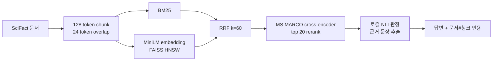

# WO-02 · 하이브리드 검색 기반 근거 인용 RAG(citation RAG)
> 개인 프로젝트 · 대응 직군: AI 엔지니어 / 검색 ML · 데이터: BEIR SciFact (claims/annotations: CC BY 4.0, abstracts: ODC-By 1.0)

## 문제 정의

키워드 검색은 정확한 용어와 숫자에 강하지만 의미가 비슷한 표현을 놓치고, 밀집 검색(dense retrieval)은 의미 유사성을 찾지만 희귀어와 정확 일치에 약하다. 이 프로젝트는 같은 문서 청크 위에 BM25와 FAISS HNSW 밀집 인덱스를 만들고, RRF와 교차 인코더 재순위화(cross-encoder reranking)를 단계적으로 적용해 검색 성능 변화를 측정한다. 검색된 근거로 로컬 NLI(자연어 추론, Natural Language Inference) 답변을 만들고 모든 답변에 `[문서ID#청크ID]` 인용을 붙여 검색 품질과 생성 품질을 별도로 평가한다.

## 가설

1. BM25와 밀집 검색을 RRF로 결합하면 서로 다른 실패를 보완해 BM25보다 Recall@10과 nDCG@10이 높아진다.
2. 교차 인코더가 상위 후보를 질의와 함께 읽으면 정답 문서의 순위가 더 올라간다.
3. 답변을 근거 문장의 추출형 판정으로 제한하면 모든 답변에 검증 가능한 청크 인용을 남길 수 있다.

## 접근 — 시도 순서

**1차 (검색 단계, WO-01 설정 재사용)**: WO-01에서 가장 좋았던 128-token 청크·BM25·밀집 검색·RRF 조합을 그대로 가져왔다. 하이브리드 RRF Recall@10 0.8244로 가설 1을 재확인했다.

**2차 (재순위화기 추가, 가설 2 검증)**: 상위 20개 후보에 교차 인코더를 적용했다. 예상과 달리 MRR만 0.0008 상승하고 Recall@10·nDCG@10은 오히려 낮아졌다. MS MARCO로 학습된 재순위화기가 SciFact의 과학 주장 검증 도메인과 맞지 않는다는 신호로 판단해, 운영 기본값은 RRF 단독으로 정하고 재순위화기는 도메인 특화 모델 교체 전까지 보류했다.

**3차 (생성 — 다문서 컨텍스트 시도)**: 가설 3을 검증하기 위해 처음에는 재순위화 상위 5개 문서를 모두 NLI에 입력했다. 로컬 NLI가 비정답 문장의 점수를 과신해 잘못된 문서를 인용하는 사례가 늘었다.

**4차 (생성 — top-1 제한으로 수정)**: 생성 컨텍스트를 최상위 1개 문서로 제한했다. 인용 정확도는 개선됐지만, 정답이 2위 이하인 질문에서는 애초에 답변 기회가 사라지는 새로운 실패 유형이 드러났다 — 이는 WO-02의 핵심 발견이자 다음 프로젝트(컨텍스트 선택 보정)의 출발점이 됐다.

## 데이터

- **검색 평가**: [BEIR SciFact](https://github.com/beir-cellar/beir) test qrels, 5,183개 문서와 300개 질의
- **생성 평가**: SciFact의 사람 라벨이 있는 주장 30개. 사실 조회, 비교, 수치·계산형을 각 10개씩 고정 선택
- **라이선스**: SciFact의 claims/annotations는 CC BY 4.0, 논문 abstracts는 ODC-By 1.0
- **원본 데이터 관리**: 원본과 모델 캐시는 Git에 넣지 않는다. [`data/download.py`](data/download.py)가 압축 파일의 MD5를 확인하고 안전하게 압축을 푼다.

```bash
python3.11 -m venv .venv
source .venv/bin/activate
pip install -r requirements.txt
python run.py
pytest -q
```

첫 실행에는 Hugging Face 모델 다운로드가 필요하다.

## 파이프라인



- 128-token 청크, 24-token overlap(겹침)을 사용한다.
- BM25와 `all-MiniLM-L6-v2` 밀집 검색이 각각 상위 50개 문서를 반환한다.
- RRF(`k=60`)가 점수 정규화 없이 두 순위를 합친다.
- `ms-marco-MiniLM-L-6-v2`가 상위 20개 후보를 재정렬한다.
- `nli-deberta-v3-xsmall`이 최상위 문서에서 SUPPORT/CONTRADICT 판정과 근거 문장을 고른다.
- 검색은 300개 전체 질의로, 생성은 유형별 10개씩 총 30개로 평가한다.

Docker Compose로 같은 과정을 재현할 수 있다.

```bash
docker compose run --rm hybrid-rag
```

## 결과 (Ship Gate 표)

### 검색 단계별 비교

| 단계 | 질의 수 | Recall@10 | MRR | nDCG@10 |
|---|---:|---:|---:|---:|
| BM25 | 300 | 0.7575 | 0.5942 | 0.6261 |
| Dense HNSW | 300 | 0.8015 | 0.6417 | 0.6728 |
| Hybrid RRF | 300 | **0.8244** | 0.6597 | **0.6905** |
| Hybrid + reranker | 300 | 0.8096 | **0.6605** | 0.6843 |

| Ship Gate 지표 | 목표 | 실제 |
|---|---|---:|
| Hybrid+rerank Recall@10 개선폭 | BM25보다 개선 | **+5.21%p** |
| Hybrid+rerank nDCG@10 개선폭 | BM25보다 개선 | **+5.82%p** |
| 답변의 출처 청크 인용 포함률 | 100% | **100% (30/30)** |
| 충실도(faithfulness) 분리 보고 | 검색 단계와 별도 | **0.5667** |
| 검색 실패와 생성 실패 분리 | 별도 집계 | **53/300, 13/30** |

운영 기본값은 **Hybrid RRF**다. RRF가 두 검색기의 상호 보완 효과를 가장 잘 냈고, Hybrid+rerank는 BM25 기준 Ship Gate는 통과했지만 RRF 단독 대비 Recall@10 -1.49%p, nDCG@10 -0.62%p로 낮았다.

### 생성 품질

| 지표 | 값 | 정의 |
|---|---:|---|
| 인용 포함률 (Citation coverage) | 1.0000 | 답변에 `[문서ID#청크ID]`가 있는 비율 |
| 인용 정확도 (Citation correctness) | 0.8333 | 인용 문서가 사람 라벨의 정답 문서인 비율 |
| 추출적 근거 일치도 (Extractive grounding) | 1.0000 | 답변 근거 문장이 인용 청크에 실제 존재하는 비율 |
| 충실도 (Faithfulness) | 0.5667 | 추출 근거, 정답 문서 인용, 사람 라벨과 같은 판정을 모두 만족한 비율 |
| 답변 관련성 코사인 (Answer relevance cosine) | 0.6261 | 질문과 답변 MiniLM 임베딩의 평균 코사인 유사도 |
| 판정 정확도 (Verdict accuracy) | 0.6333 | SUPPORT/CONTRADICT 판정 정확도 |

인용 포함률(인용 형식 존재)과 충실도(근거의 실질적 정확성)는 서로 다른 품질 층이다 — 인용 포함률 100%가 자동으로 충실도를 보장하지 않는다.

인용 답변 예시:

> **Claim:** ALDH1 expression is associated with poorer prognosis in breast cancer.  
> **Answer:** SUPPORT. in a series of 577 breast carcinomas, expression of aldh1 detected by immunostaining correlated with poor prognosis. **[45638119#c1]**

전체 수치는 [`results/experiments.json`](results/experiments.json), 답변 30개는 [`results/answers.json`](results/answers.json), 읽기 쉬운 결과표는 [`results/report.md`](results/report.md)에 저장했다.

검색 실패 53건과 생성 실패 13건의 대표 사례, 원인, 다음 실험은 [`results/error_analysis.md`](results/error_analysis.md)에 정리했다.

## 측정 경계

30개 생성 질문은 SciFact 주장에 유형 라벨을 수작업으로 붙인 고정 평가셋이다. `calculation`은 자유 형식 산술이 아니라 숫자·비율·기간을 포함한 주장 검증이다. 생성기는 top-1 문서만 사용하므로 정답이 상위 10개 안에 있어도 1위가 아니면 인용 기회가 없다. 충실도는 자동 지표이며 사람 평가를 대체하지 않는다. HNSW·로컬 모델 설정은 CPU 재현성 기준이며 지연시간·동시 처리량은 별도 벤치마크 대상이다. 논문 표·그림은 텍스트 초록에 포함되지 않아 멀티모달 질의는 다루지 않는다.

**다음 단계**: 상위 문서별 NLI 점수와 검색 점수를 함께 보정하는 컨텍스트 선택(context selection), 과학·의생명 도메인 특화 재순위화기 재평가.

## 개발 방식 (AI 활용 구분)

| 직접 작성한 것 | Codex가 생성한 것 |
|---|---|
| 문제 범위, WO-01의 128-token 설정 재사용, Ship Gate와 포트폴리오 요구사항, top-1 제한 결정 | BM25·FAISS·RRF·재순위화 구현, 로컬 NLI 인용 생성기, 평가 및 오류 분석 코드 |
| 단계별 비교와 실패 유형을 분리해야 한다는 평가 기준 | Docker Compose 환경, pytest 테스트, 측정 결과 아티팩트와 문서 초안 |

## 용어집

| 용어 | 뜻 |
|---|---|
| BM25 | 문서 내 단어 빈도와 역문서 빈도로 정확한 키워드 일치를 평가하는 전통적 희소 검색 알고리즘 |
| 투타워 밀집 검색 (Two-tower dense retrieval) | 질의와 문서를 별도로 임베딩해 ANN(근사 최근접 이웃) 인덱스로 빠르게 후보를 찾는 방식 |
| FAISS HNSW | 그래프 기반 근사 최근접 이웃 검색으로 밀집 검색 후보를 빠르게 찾는 인덱스 구조 |
| RRF (Reciprocal Rank Fusion, 상호 순위 융합) | 서로 다른 점수 체계 대신 각 검색기의 순위를 합쳐 결과를 융합하는 기법 |
| 교차 인코더 (Cross-encoder) | 질의와 문서를 함께 입력해 후보 수는 적지만 더 정밀하게 관련도를 평가하는 모델 |
| RAG 인용 (RAG citation) | 답변의 주장과 근거 청크를 연결해 사용자가 출처를 역추적하게 하는 장치 |
| 충실도 (Faithfulness) | 답변이 인용한 근거와 정답 관계를 실제로 따르는지 측정하는 지표 |
| NLI (Natural Language Inference, 자연어 추론) | 전제와 가설 문장 사이의 함의·모순·중립 관계를 판정하는 과제 |

## English Technical Summary

Built a fully local hybrid RAG evaluation pipeline on the BEIR SciFact test set. The system chunks 5,183 documents into 18,142 overlapping 128-token passages, retrieves with BM25 and MiniLM embeddings over a FAISS HNSW index, fuses rankings with Reciprocal Rank Fusion, and reranks the top 20 candidates with an MS MARCO cross-encoder. Hybrid RRF achieved the best retrieval result: 0.8244 Recall@10 and 0.6905 nDCG@10. Hybrid plus reranking still exceeded BM25 by 5.21 and 5.82 percentage points respectively, but underperformed RRF alone on both metrics, indicating domain mismatch in the reranker.

For 30 balanced claim-verification questions, a local NLI model generated extractive SUPPORT/CONTRADICT answers with explicit document-chunk citations. Citation coverage and extractive grounding were 1.0, citation correctness was 0.8333, and the defined composite faithfulness score was 0.5667. Retrieval and generation failures are reported separately, making it possible to distinguish missing evidence from incorrect evidence selection or verdict generation.
