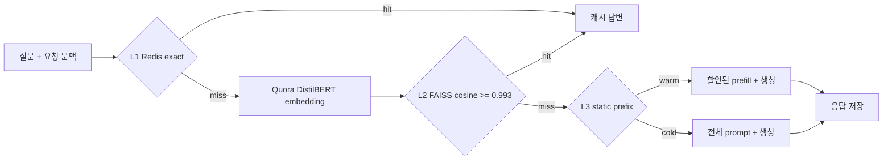

# WO-03 · 안전한 3단 시맨틱 캐시
> 개인 프로젝트 · 대응 직군: AI 엔지니어 / 백엔드 / MLOps · 데이터: Quora Question Pairs (Kaggle competition rules)

## 문제 정의

LLM 서비스에는 같은 의도의 질문이 표현만 바뀌어 반복된다. 매번 모델을 호출하면 비용과 꼬리 지연이 늘지만, 의미가 다른 질문에 이전 답을 반환하는 false hit는 비용 절감보다 큰 품질·보안 문제를 만든다. 이 프로젝트는 Redis 정확 일치, FAISS 의미 유사, 정적 시스템 프롬프트 프리픽스의 3단 캐시를 구현하고, 1,000개 요청 재생으로 비용·지연 절감과 잘못된 응답 재사용을 함께 측정한다.

## 가설

1. 정확 일치 응답 캐시는 반복 질문의 생성 비용과 지연을 거의 제거한다.
2. 시맨틱 캐시는 표현이 다른 중복 질문까지 재사용할 수 있지만, 임계값을 낮추면 false hit가 급격히 증가한다.
3. 응답을 재사용할 수 없는 요청도 정적 시스템 프롬프트 프리픽스를 재사용하면 입력 비용과 prefill 지연을 줄일 수 있다.
4. 시스템 프롬프트 버전과 tenant 문맥을 키에 포함하면 정책 변경과 고객 간 답변 혼입을 막을 수 있다.

## 데이터

- **원본**: Quora Question Pairs의 `sentence1`, `sentence2`, `is_duplicate` 사람 라벨
- **접근 경로**: [Sentence Transformers Quora mirror](https://huggingface.co/datasets/sentence-transformers/quora-duplicates), 리비전 `41f6997...` 고정
- **임계값 튜닝**: positive 1,000개와 negative 1,000개
- **재생 트래픽**: 튜닝셋과 겹치지 않는 500쌍에서 seed와 후속 요청을 만들어 총 1,000개
- **라벨 보정**: 대소문자·구두점·공백 제거 후 완전히 같은데 negative인 라벨만 deterministic judge로 보정했다. 전체 실험 표본 2,500쌍 중 3건이며 결과 JSON에 기록한다.
- **라이선스**: Kaggle competition rules 적용. 원본 parquet는 Git에 커밋하지 않는다.

[`data/download.py`](data/download.py)는 데이터 리비전과 SHA-256을 고정해 33 MB parquet를 검증한다.

```bash
python3.11 -m venv .venv
source .venv/bin/activate
pip install -r requirements.txt
docker compose up -d redis
python run.py
pytest -q
```

전체 환경은 다음 명령으로 재현할 수 있다.

```bash
docker compose run --rm semantic-cache
```

## 접근 / 파이프라인



### 캐시 키와 격리

응답 캐시 scope에는 아래 필드를 모두 넣는다.

```text
model + temperature + tool set + system prompt version + tenant ID + customer tier
```

질문만 키로 사용하지 않기 때문에 다른 tenant나 정책 버전의 답변을 재사용할 수 없다. L3는 사용자 답변이 아니라 정적 시스템 프롬프트 블록만 저장하므로 tenant ID를 제외하되, model·temperature·tools·prompt version·customer tier로 격리한다.

- Redis L1과 L3는 `SETEX`로 1시간 TTL을 적용한다.
- FAISS L2는 각 scope별 `IndexFlatIP`를 사용하고, 만료된 메타데이터와 벡터를 함께 제거한다.
- 프롬프트 버전 변경은 키 공간을 자동 분리하며, `invalidate_prompt_version()`으로 이전 Redis·FAISS 항목을 명시적으로 지울 수 있다.
- 비용과 지연은 결정적 LLM workload simulator로 비교한다. Redis와 FAISS 적중은 실제 실행하지만, API 비용과 지연은 공급자 실측값이 아니다.

## 결과 (Ship Gate 표)


| 지표 | 목표 | 실제 |
|---|---|---:|
| 재생 요청 수 | 1,000 | **1,000** |
| 응답 캐시 hit rate | 보고 | **15.90%** |
| 프리픽스 포함 cache assist | 보고 | **99.80%** |
| Semantic false-hit rate | < 1% | **0.00% (0/9)** |
| 모델링 비용 | 절감 | **$2.2184 → $0.7202, 67.53% 절감** |
| 모델링 p50 지연 | 절감 | **1,500.50ms → 1,204.09ms, 19.75% 절감** |
| 모델링 p95 지연 | 절감 | **1,742.77ms → 1,469.21ms, 15.70% 절감** |
| 시스템 프롬프트 변경 | 기존 캐시 miss | **v1 exact hit → v2 miss** |

캐시 단계별 요청 수는 exact 150, semantic 9, prefix 839, cold miss 2였다. 응답 캐시 적중은 모델 생성을 생략하고, prefix 적중은 모델링된 시스템 프롬프트 입력 비용의 90%와 prefill 260ms를 절감한다.

### 임계값 결정


| Cosine 임계값 | Precision | Recall | False-hit rate | Coverage |
|---:|---:|---:|---:|---:|
| 0.900 | 94.69% | 79.96% | 5.31% | 42.35% |
| 0.950 | 97.02% | 51.94% | 2.98% | 26.85% |
| 0.980 | 99.09% | 21.73% | 0.91% | 11.00% |
| 0.990 | 100.00% | 9.67% | 0.00% | 4.85% |
| **0.993** | **100.00%** | **5.18%** | **0.00%** | **2.60%** |

0.980도 튜닝셋에서 1% 미만이지만 표본 변화에 대한 여유가 작다. 99.5% precision 정책을 처음 만족한 0.990에 0.003 안전 마진을 더해 **0.993**을 운영점으로 선택했다. 별도 재생셋에서도 false hit는 0건이었지만 semantic hit가 9건으로 줄었다. 이 프로젝트에서는 잘못된 답변 비용이 캐시 miss 비용보다 크다는 보수적 고객지원 시나리오를 가정했다.

상세 수치는 [`results/experiment.json`](results/experiment.json), 1,000개 요청 결과는 [`results/replay_records.json`](results/replay_records.json), 전체 곡선은 [`results/precision_curve.csv`](results/precision_curve.csv), 브라우저 대시보드는 [`results/dashboard.html`](results/dashboard.html)에 있다.

## 시행착오와 해결

- 범용 `all-MiniLM-L6-v2`는 0.98에서도 false hit가 2.74%여서 Ship Gate를 만족하지 못했다. Quora 중복 질문에 맞춰 학습된 `quora-distilbert-base`로 교체했다.
- 원본 negative 라벨 중 “Hushed (app)”의 대소문자와 괄호 공백만 다른 완전 동일 질문이 있었다. 데이터셋 설명이 라벨 노이즈를 명시하므로, 영숫자 정규화 후 완전히 같은 경우만 안전한 재사용으로 보정하고 보정 수를 공개했다.
- 임계값 0.980은 튜닝셋 false hit 0.91%로 기준을 간신히 통과했지만 운영 변동에 취약했다. 0.993으로 올려 별도 재생에서 0%를 확인했다.
- 전체 hit rate 하나로 exact 응답 재사용과 prefix 보조를 합치면 효과를 과장할 수 있다. 응답 hit rate 15.9%와 cache assist 99.8%를 분리 보고했다.
- 실제 LLM API를 호출하지 않고도 재현되도록 비용·지연을 결정적으로 모델링했다. 대시보드와 결과표에 실측값이 아니라는 경계를 표시했다.

## 한계

- 각 Quora 쌍을 별도 tenant scope로 격리해 라벨로 false hit를 정확히 판정했다. 실제 서비스의 한 tenant 안에는 후보가 여러 개이므로 ANN 후보 충돌을 추가 평가해야 한다.
- semantic hit가 9건뿐이어서 0% false hit의 통계적 신뢰 구간은 넓다. 더 큰 재생셋과 온라인 shadow traffic이 필요하다.
- 비용과 p50/p95는 고정 가격·토큰·지연 가정으로 만든 시뮬레이션이다. 실제 모델, 리전, 동시성, 네트워크에 따라 달라진다.
- Redis 영속성, multi-process FAISS 동기화, eviction 정책, stampede 방지는 구현 범위에 포함하지 않았다.
- Quora 문장은 고객지원 대화의 사용자·주문·권한 문맥을 포함하지 않는다. 실제 도입 전 도메인 로그로 임계값을 다시 튜닝해야 한다.

## 개발 방식 (AI 활용 구분)

| 직접 작성한 것 | Codex가 생성한 것 |
|---|---|
| 3단 캐시 요구사항, false hit 1% 기준, 시스템 프롬프트 버전과 고객 문맥 격리 원칙 | Redis exact/prefix, FAISS semantic cache, TTL·무효화, 재생 하네스 구현 |
| 임계값을 품질 위험과 비용 사이의 비즈니스 결정으로 평가하는 기준 | 데이터 검증 다운로드, 임계값 곡선, 비용·지연 시뮬레이터, 대시보드와 테스트 |
| 포트폴리오에서 강조할 Ship Gate와 결과 해석 | 반복 실행, 실패 원인 분석, 타입·독스트링 검사, Docker 재현성 검증 |

AI가 생성한 코드는 실제 Redis·FAISS 실행, 1,000요청 재생, 회귀 테스트로 검증했다. 측정 경계와 라벨 보정은 결과물에 명시했다.

## 관련 개념

- **Exact cache**: 정규화된 요청과 전체 문맥이 같을 때만 응답을 재사용한다.
- **Semantic cache**: 임베딩 근접도를 이용해 표현이 다른 같은 의도의 응답을 재사용한다.
- **Prefix cache**: 반복되는 정적 시스템 프롬프트의 prefill 계산을 줄인다.
- **Precision**: 캐시가 hit라고 판단한 요청 중 실제로 같은 의도인 비율이다.
- **False-hit rate**: 시맨틱 hit 중 다른 의도의 답변을 잘못 재사용한 비율이다.
- **TTL과 invalidation**: 오래되거나 정책 버전이 바뀐 항목을 자동·명시적으로 제거한다.
- **p95 latency**: 요청의 95%가 이 값 이내에 끝나는 꼬리 지연 지표다.

## English Technical Summary

Built a three-tier LLM cache with Redis exact matching, tenant-isolated FAISS semantic retrieval, and static system-prompt prefix reuse. Cache keys include model, temperature, tools, system-prompt version, tenant ID, and customer tier. Redis and semantic entries have one-hour TTLs, and prompt-version invalidation removes both Redis and FAISS state.

A Quora-trained DistilBERT bi-encoder was tuned on 2,000 labeled pairs and evaluated on a separate 1,000-request replay. A conservative 0.993 cosine threshold produced 9 semantic hits with zero false hits, satisfying the <1% gate, while 150 exact hits yielded a 15.9% response hit rate. Prefix reuse assisted another 839 requests. Under the documented deterministic workload model, total cost fell by 67.53%, p50 latency by 19.75%, and p95 latency by 15.70%. Changing the system prompt from v1 to v2 caused the same question to miss, demonstrating version-safe cache busting.
