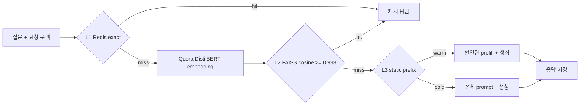
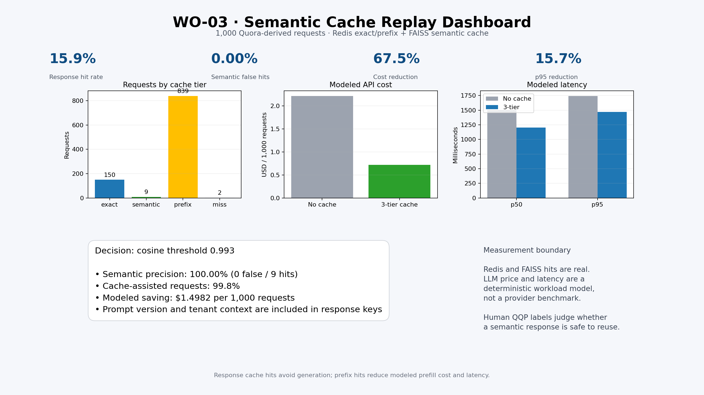
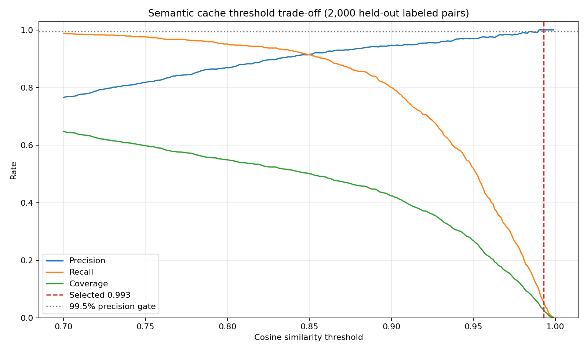

# WO-03 · 안전한 3단 시맨틱 캐시(semantic cache)
> 개인 프로젝트 · 대응 직군: AI 엔지니어 / 백엔드 / MLOps · 데이터: Quora Question Pairs (Kaggle competition rules)

## 문제 정의

LLM 서비스에는 같은 의도의 질문이 표현만 바뀌어 반복된다. 매번 모델을 호출하면 비용과 꼬리 지연(tail latency)이 늘지만, 의미가 다른 질문에 이전 답을 반환하는 오탐 적중(false hit)은 비용 절감보다 큰 품질·보안 문제를 만든다. 이 프로젝트는 Redis 정확 일치, FAISS 의미 유사(semantic), 정적 시스템 프롬프트 프리픽스(prefix, 앞부분 고정 구간)의 3단 캐시를 구현하고, 1,000개 요청 재생으로 비용·지연 절감과 잘못된 응답 재사용을 함께 측정한다.

## 가설

1. 정확 일치 응답 캐시는 반복 질문의 생성 비용과 지연을 거의 제거한다.
2. 시맨틱 캐시는 표현이 다른 중복 질문까지 재사용할 수 있지만, 임계값을 낮추면 오탐 적중이 급격히 증가한다.
3. 응답을 재사용할 수 없는 요청도 정적 시스템 프롬프트 프리픽스를 재사용하면 입력 비용과 프리필(prefill, 입력 처리 단계) 지연을 줄일 수 있다.
4. 시스템 프롬프트 버전과 테넌트(tenant, 고객사 단위) 문맥을 키에 포함하면 정책 변경과 고객 간 답변 혼입을 막을 수 있다.

## 접근 — 시도 순서

**1차 (범용 임베딩)**: `all-MiniLM-L6-v2`로 L2 시맨틱 캐시를 구현했다. 임계값 0.98에서도 오탐 적중 2.74%로 Ship Gate(<1%) 미달 — 범용 임베딩이 질문 중복 탐지라는 좁은 과제에는 충분히 정밀하지 않다는 신호.

**2차 (도메인 특화 임베딩 교체)**: Quora 중복 질문으로 학습된 `quora-distilbert-base`로 교체했다. 오탐 적중이 즉시 개선됐고, 가설 2를 검증할 수 있는 정밀도-재현율-임계값(precision-recall-threshold) 곡선을 얻었다.

**3차 (임계값 0.980 시도)**: 정밀도 정책(99.5%)을 처음 만족하는 지점을 찾았다. 튜닝셋 오탐 적중은 0.91%로 기준은 통과했지만 분포 변화에 대한 여유가 작다고 판단.

**4차 (안전 마진 적용)**: 0.990에 0.003 마진을 더한 0.993을 운영점으로 선택했다. 커버리지(coverage, 적중 범위)는 2.60%로 낮아지지만, 별도 재생셋에서 오탐 적중 0/9를 확인 — 잘못된 적중 1건의 비용이 놓침(miss) 여러 건보다 큰 고객지원 시나리오에 맞춘 결정.

**5차 (적중률 지표 분해)**: 초기에는 전체 적중률(hit rate) 하나로 보고하려 했으나, 정확 일치 응답 재사용(159건)과 프리픽스 보조(839건)를 합치면 효과가 과장된다는 것을 발견해 응답 적중률과 캐시 보조율(cache assist rate)을 분리했다.

## 데이터

- **원본**: Quora Question Pairs의 `sentence1`, `sentence2`, `is_duplicate` 사람 라벨
- **접근 경로**: [Sentence Transformers Quora mirror](https://huggingface.co/datasets/sentence-transformers/quora-duplicates), 리비전 `41f6997...` 고정
- **임계값 튜닝**: positive 1,000개와 negative 1,000개
- **재생 트래픽**: 튜닝셋과 겹치지 않는 500쌍에서 seed와 후속 요청을 만들어 총 1,000개
- **라벨 보정**: 대소문자·구두점·공백 제거 후 완전히 같은데 negative인 라벨만 결정론적 판정(deterministic judge)으로 보정했다. 전체 실험 표본 2,500쌍 중 3건이며 결과 JSON에 기록한다.
- **라이선스**: Kaggle competition rules 적용. 원본 parquet는 Git에 커밋하지 않는다.

[`data/download.py`](data/download.py)는 데이터 리비전과 SHA-256을 고정해 33 MB parquet를 검증한다.

```bash
python3.11 -m venv .venv
source .venv/bin/activate
pip install -r requirements.txt
docker compose up -d redis
python run.py
pytest -q
```

전체 환경은 다음 명령으로 재현할 수 있다.

```bash
docker compose run --rm semantic-cache
```

## 파이프라인



### 캐시 키와 격리

응답 캐시 범위(scope)에는 아래 필드를 모두 넣는다.

```text
model + temperature + tool set + system prompt version + tenant ID + customer tier
```

질문만 키로 사용하지 않기 때문에 다른 테넌트나 정책 버전의 답변을 재사용할 수 없다. L3는 사용자 답변이 아니라 정적 시스템 프롬프트 블록만 저장하므로 테넌트 ID를 제외하되, 모델·온도(temperature)·도구·프롬프트 버전·고객 등급으로 격리한다.

- Redis L1과 L3는 `SETEX`로 1시간 TTL(Time To Live, 유효 시간)을 적용한다.
- FAISS L2는 각 범위별 `IndexFlatIP`를 사용하고, 만료된 메타데이터와 벡터를 함께 제거한다.
- 프롬프트 버전 변경은 키 공간을 자동 분리하며, `invalidate_prompt_version()`으로 이전 Redis·FAISS 항목을 명시적으로 지울 수 있다.

## 결과 (Ship Gate 표)



| 지표 | 목표 | 실제 |
|---|---|---:|
| 재생 요청 수 | 1,000 | **1,000** |
| 응답 캐시 적중률 | 보고 | **15.90%** |
| 프리픽스 포함 캐시 보조율 | 보고 | **99.80%** |
| 시맨틱 오탐 적중률 | < 1% | **0.00% (0/9)** |
| 모델링 비용 | 절감 | **$2.2184 → $0.7202, 67.53% 절감** |
| 모델링 p50 지연 | 절감 | **1,500.50ms → 1,204.09ms, 19.75% 절감** |
| 모델링 p95 지연 | 절감 | **1,742.77ms → 1,469.21ms, 15.70% 절감** |
| 시스템 프롬프트 변경 | 기존 캐시 miss | **v1 exact hit → v2 miss** |

캐시 단계별 요청 수는 정확 일치 150, 시맨틱 9, 프리픽스 839, 콜드 미스(cold miss, 캐시 전혀 없음) 2였다. 응답 캐시 적중은 모델 생성을 생략하고, 프리픽스 적중은 모델링된 시스템 프롬프트 입력 비용의 90%와 프리필 260ms를 절감한다.

**측정 방식**: Redis·FAISS 적중은 실제 실행, 비용·지연은 토큰 단가·프리필 절감 가정 기반 시뮬레이션.

### 임계값 결정



| 코사인 임계값 | 정밀도 | 재현율 | 오탐 적중률 | 커버리지 |
|---:|---:|---:|---:|---:|
| 0.900 | 94.69% | 79.96% | 5.31% | 42.35% |
| 0.950 | 97.02% | 51.94% | 2.98% | 26.85% |
| 0.980 | 99.09% | 21.73% | 0.91% | 11.00% |
| 0.990 | 100.00% | 9.67% | 0.00% | 4.85% |
| **0.993** | **100.00%** | **5.18%** | **0.00%** | **2.60%** |

상세 수치는 [`results/experiment.json`](results/experiment.json), 1,000개 요청 결과는 [`results/replay_records.json`](results/replay_records.json), 전체 곡선은 [`results/precision_curve.csv`](results/precision_curve.csv), 브라우저 대시보드는 [`results/dashboard.html`](results/dashboard.html)에 있다.

## 측정 경계

각 Quora 쌍을 별도 테넌트 범위로 격리해 오탐 적중을 라벨 기준으로 정확히 판정했다 — 실서비스에서는 한 테넌트 안에 후보가 여러 개이므로 근사 최근접 이웃(ANN) 후보 충돌을 추가 평가해야 한다. 시맨틱 적중이 9건뿐이라 0% 오탐 적중의 통계적 신뢰 구간은 넓다. 비용·p50/p95는 고정 가격·토큰·지연 가정 기반 시뮬레이션이며 실제 모델·리전·동시성에 따라 달라진다. Redis 영속성, 다중 프로세스 FAISS 동기화, 축출 정책(eviction policy), 캐시 쇄도 방지(cache stampede)는 구현 범위 밖이다. Quora 문장은 고객지원 대화의 사용자·주문·권한 문맥을 포함하지 않는다.

**다음 단계**: 더 큰 재생셋과 온라인 섀도 트래픽(shadow traffic)으로 임계값·테넌트 내 ANN 충돌 재검증, 도메인 로그 기반 임계값 재튜닝.

## 개발 방식 (AI 활용 구분)

| 직접 작성한 것 | Codex가 생성한 것 |
|---|---|
| 3단 캐시 요구사항, 오탐 적중 1% 기준, 시스템 프롬프트 버전과 고객 문맥 격리 원칙, 안전 마진 결정 | Redis exact/prefix, FAISS semantic cache, TTL·무효화, 재생 하네스 구현 |
| 임계값을 품질 위험과 비용 사이의 비즈니스 결정으로 평가하는 기준 | 데이터 검증 다운로드, 임계값 곡선, 비용·지연 시뮬레이터, 대시보드와 테스트 |

## 용어집

| 용어 | 뜻 |
|---|---|
| 정확 일치 캐시 (Exact cache) | 정규화된 요청과 전체 문맥이 같을 때만 응답을 재사용하는 캐시 계층 |
| 시맨틱 캐시 (Semantic cache) | 임베딩 근접도를 이용해 표현이 다른 같은 의도의 응답을 재사용하는 캐시 계층 |
| 프리픽스 캐시 (Prefix cache) | 반복되는 정적 시스템 프롬프트의 프리필 계산을 줄이는 캐시 계층 |
| 정밀도 (Precision) | 캐시가 적중이라고 판단한 요청 중 실제로 같은 의도인 비율 |
| 오탐 적중률 (False-hit rate) | 시맨틱 적중 중 다른 의도의 답변을 잘못 재사용한 비율 |
| TTL과 무효화 (TTL and invalidation) | 오래되거나 정책 버전이 바뀐 항목을 자동·명시적으로 제거하는 메커니즘 |
| p95 지연 (p95 latency) | 요청의 95%가 이 값 이내에 끝나는 꼬리 지연 지표 |
| 테넌트 (Tenant) | 같은 서비스를 공유해 쓰는 고객사 또는 고객 단위. 격리가 깨지면 다른 고객의 답변이 섞일 수 있다 |

## English Technical Summary

Built a three-tier LLM cache with Redis exact matching, tenant-isolated FAISS semantic retrieval, and static system-prompt prefix reuse. Cache keys include model, temperature, tools, system-prompt version, tenant ID, and customer tier. Redis and semantic entries have one-hour TTLs, and prompt-version invalidation removes both Redis and FAISS state.

A Quora-trained DistilBERT bi-encoder was tuned on 2,000 labeled pairs and evaluated on a separate 1,000-request replay. A conservative 0.993 cosine threshold produced 9 semantic hits with zero false hits, satisfying the <1% gate, while 150 exact hits yielded a 15.9% response hit rate. Prefix reuse assisted another 839 requests. Under the documented deterministic workload model, total cost fell by 67.53%, p50 latency by 19.75%, and p95 latency by 15.70%. Changing the system prompt from v1 to v2 caused the same question to miss, demonstrating version-safe cache busting.
