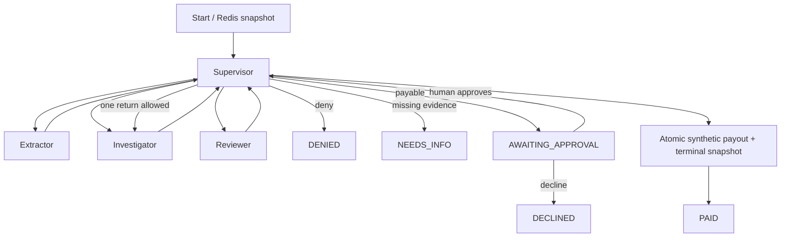

# WO-04 · 재개 가능한 멀티워커 오케스트레이션(multi-worker orchestration)
> 개인 프로젝트 · 대응 직군: AI 엔지니어 / LLM 애플리케이션 · 데이터: 직접 생성한 합성 보험 청구 30건 (제3자 원본 데이터·개인정보 없음)

## 문제 정의

여러 전문 워커로 업무를 나눌 때 핵심 위험은 워커 수보다 종료되지 않는 반복, 관측되지 않는 비용, 승인 전 외부 쓰기, 재시작 후 중복 실행이다. 이 프로젝트는 감독자(supervisor)가 추출기(extractor), 조사기(investigator), 검토기(reviewer)의 결과를 받아 모든 경로를 결정하는 상태 머신을 구현한다. 각 워커의 출력은 JSON Schema로 검증하고, 모든 노드 뒤의 상태와 실행 추적(trace)을 Redis에 저장한다. 합성 지급 기록은 사람 승인 후에만 생성한다.

**구현 범위**: 이 데모의 워커는 결정적 규칙이며 LLM API를 호출하지 않는다. 비용·토큰은 노드별 고정 추정치다. 실험이 증명하는 것은 오케스트레이션의 경계·재개·승인·멱등성(idempotency)이다.

## 가설

1. 타입 있는 핸드오프(handoff, 작업 전달)와 중앙 감독자를 두면 워커 간 자유 텍스트 대화 없이 모든 노드 경로를 추적할 수 있다.
2. 노드마다 Redis 스냅샷을 저장하고 지급 기록과 최종 스냅샷을 원자적으로 기록하면 중단 후 재개해도 지급이 중복되지 않는다.
3. 검토기가 재조사를 요청해도 재시도 횟수와 스텝·토큰·비용 상한을 코드로 검사하면 작업이 끝난다.
4. 지급 가능 판정과 지급 실행 사이를 사람 승인 상태로 분리하면 승인 전 쓰기를 막을 수 있다.

## 접근 — 시도 순서

**1차 (토큰 상한 2,000 설정)**: 가설 3을 검증하기 위해 스텝·토큰·비용 상한을 코드로 걸었다. 30건을 실행하니 검토기 재조사가 있는 정상 사례가 `TOKEN_LIMIT`으로 조기 종료됐다 — 정상 경로의 실제 토큰 사용량을 과소평가한 것.

**2차 (실측 기반 상한 재조정)**: 30건의 실제 경로를 전수 실행해 최장 2,025토큰을 확인하고 상한을 3,000으로 올렸다. 동시에 낮은 상한을 강제로 주입해 가드가 실제로 작동하는지 검증하는 테스트를 별도로 남겼다 — 상한 완화와 가드 검증을 함께 처리.

**3차 (지급·상태 저장 분리 시도)**: 처음에는 Redis 스냅샷과 지급 기록을 별도 쓰기로 저장했다. 두 쓰기 사이에 프로세스가 중단되면 중복 지급이나 상태 불일치가 발생할 수 있다는 걸 재개 테스트 중 발견.

**4차 (Lua 원자적 커밋으로 수정)**: 리비전 확인, 지급 키 생성, 최종 상태 저장을 Redis Lua 스크립트 한 연산으로 묶었다. 재개 시연에서 중복 지급 0건을 확인해 가설 2를 검증.

**5차 (검토기 되돌림 루프 방지)**: 재조사 요청을 무제한 허용하면 루프 위험이 있어, 감독자 레벨에서 1회로 제한하고 전역 스텝 상한을 별도로 뒀다 — 5건 모두 1회 반환 후 정상 종료.

## 데이터

`data/generate.py`가 라벨이 있는 합성 보험 청구 30건을 생성한다. `data/cases.json`은 재현을 위해 커밋한다. 지급 가능 10건, 거절 10건, 증빙 부족 10건이다. 지급 가능 5건에는 보조 영수증을 넣어 검토기가 조사 워커에 한 번 되돌려보내도록 했다. 개인정보와 실제 보험 청구 문서는 없다. 데이터 생성 방법과 라벨의 성격은 [data/README.md](data/README.md)에 기록했다.

## 파이프라인



- `src/workers.py`: 각 전문 워커는 순수 함수이며 다른 워커를 직접 호출하지 않는다.
- `src/contracts.py`: `extracted`, `investigated`, `reviewed` 핸드오프의 필수 필드·타입·허용값을 검사하고 추가 필드를 거부한다.
- `src/engine.py`: 감독자의 라우팅, 최대 16스텝·3,000 추정 토큰·$0.005 추정 비용 상한을 노드 **실행 전** 검사한다.
- `src/store.py`: Redis compare-and-swap으로 오래된 스냅샷 쓰기를 막고, Lua 스크립트에서 지급 기록과 `PAID` 상태를 함께 커밋한다.
- 모든 노드 뒤의 Redis 스냅샷에는 다음 노드, 단계, 워커 결과, 승인 정보, 비용·토큰, 순서가 있는 경로 추적이 포함된다.
- `AWAITING_APPROVAL`은 자동으로 통과하지 않는다. `Engine.decide(..., actor=...)` 호출이 있어야 한다. 30건의 대량 재생은 `synthetic-evaluation-approver`라는 스크립트 승인을 사용한다.

### 재현

프로젝트 폴더에서:

```bash
docker compose up --build --abort-on-container-exit --exit-code-from orchestration
```

이 명령은 Redis와 Python 3.11 컨테이너를 띄워 30건 재생, 결과 파일 생성, pytest 통합 테스트를 수행한다. Redis는 named volume에 AOF를 기록하므로 Python 프로세스를 재시작해도 스냅샷이 남는다. 결과는 `results/`에 저장된다.

수동 승인·재개 시연:

```bash
docker compose up -d redis
docker compose run --rm orchestration python manage.py start C001 --events 3
docker compose run --rm orchestration python manage.py resume C001
docker compose run --rm orchestration python manage.py status C001
docker compose run --rm orchestration python manage.py approve C001 --actor SONG
```

첫 명령은 세 노드 뒤에 멈추고, 두 번째는 Redis 스냅샷에서 재개해 `AWAITING_APPROVAL`까지 간다. 마지막 명령이 있어야 합성 지급 기록이 생성된다. 같은 `case_id`는 `manual` namespace에서 중복 생성할 수 없으므로 다시 시연할 때는 다른 사례를 사용한다.

## 결과 (Ship Gate 표)

Docker Compose의 Python 3.11과 Redis 7에서 측정했다. 세부 추적은 [results/experiment.json](results/experiment.json), 읽기 쉬운 30건 경로는 [results/report.md](results/report.md), 비용 그래프는 [SVG](results/cost_chart.svg)와 [PNG](results/cost_chart.png)에 있다. 평가 라벨 `gold_terminal`은 실행 상태에서 제거해 워커가 볼 수 없게 했다.

| Ship Gate | 목표 | 실제 |
|---|---|---|
| 30개 케이스와 노드 추적 | 30개 | **30/30 실행·추적 기록**, 라벨과 종료 상태 30/30 일치 |
| 스냅샷 재개 | 같은 종료 상태 | 3개 이벤트 후 중단·새 엔진에서 재개, **PAID 동일**, 노드 경로 동일, 지급 기록 1개 |
| 검토기 되돌림 종료 | 최소 1회 | **5건**에서 1회씩 반환 후 종료, 최장 13스텝/16스텝 상한 |
| 케이스당 비용 차트·상한 | 표시 및 코드 강제 | 30건 추정 비용 **$0.00217~$0.00381**, 상한 **$0.005**; 초과 시 `COST_LIMIT` 테스트 통과 |
| 사람 승인 게이트 | 지급 전 중단 | 지급 가능 **10/10건 `AWAITING_APPROVAL`**; 재생의 스크립트 승인 뒤 합성 지급 10건, 승인 전 지급 0건 |

추가 검증: `STEP_LIMIT`, `TOKEN_LIMIT`, `COST_LIMIT` 각각 독립적으로 종료하는 테스트와 승인 거절 시 지급 0건, 오래된 스냅샷 쓰기 거절, 스키마 위반 핸드오프 거절을 포함해 **9개 테스트가 통과**했다.

사례 `C001` 경로:

```text
supervisor → extractor → supervisor → investigator → supervisor
→ reviewer → supervisor → investigator → supervisor → reviewer
→ supervisor → human_approval → supervisor → payout
```

세 번째 이벤트 뒤 스냅샷의 다음 노드는 `investigator`였다. 새 Engine 인스턴스가 이 노드에서 이어 실행했고, 중단 없는 실행과 같은 경로·`PAID` 상태에 도달했다. 합성 지급 기록은 1개다.

## 측정 경계

워커는 결정적 규칙이며 합성 데이터를 처리하므로, 실제 에이전트의 자연어 추론이나 도구 선택 품질은 이 프로젝트의 증명 범위가 아니다. 비용·토큰은 고정 추정값이다. 합성 지급은 Redis 기록이며 실제 금융 지급 API·분산 트랜잭션은 연결하지 않았다. 30건 라벨은 동일한 합성 규칙으로 생성돼 독립적인 일반화 성능을 뜻하지 않는다 — 이 데이터는 모델 품질보다 오케스트레이션 제어 흐름 검증에 적합하다.

**다음 단계**: 실 LLM 워커 적용 시 토큰 계측·도구 권한 정책, 승인자 인증·책임 분리, 지급 API 멱등 키, 변조 방지 감사 로그.

### 언제 여러 워커를 쓸 것인가

이 과제에서 추출·증빙 조사·최종 검토는 입력, 검증 기준, 실패 조치가 서로 달라 분리할 가치가 있다. 현재는 결정적 규칙이므로 같은 결과를 더 간단한 단일 함수로도 낼 수 있지만, 여러 워커 구조의 추가 가치는 LLM 적용 시 독립 도구·권한·재시도 정책을 둘 수 있고 각 단계의 오류와 비용을 따로 관찰하는 데 있다. 저변동의 단순 필드 추출만 필요하다면 단일 함수가 더 적절하다.

## 개발 방식 (AI 활용 구분)

| 직접 작성한 것 | Codex가 생성한 것 |
|---|---|
| 프로젝트 목표, 기술 제약, 30건·승인·재개·비용 Ship Gate, 토큰 상한 재조정 판단 | 상태 머신, 워커, JSON Schema 계약, Redis 스냅샷·원자적 지급 기록, 테스트, 차트, 문서 초안 |
| 승인 전 쓰기 금지와 종료 조건을 검증해야 한다는 평가 기준 | 합성 데이터 생성, Docker 재현 환경, 30건 실제 실행과 결과 파일 |

## 용어집

| 용어 | 뜻 |
|---|---|
| 감독자-워커 (Supervisor-worker) | 중앙 감독자가 전문 워커의 출력만 받아 다음 노드와 종료를 결정하는 오케스트레이션 구조 |
| 타입드 핸드오프 (Typed handoff) | JSON Schema로 노드 간 결과의 형태와 허용값을 강제하는 작업 전달 방식 |
| 체크포인트/재개 (Checkpoint / resume) | 외부 저장소의 실행 상태에서 다음 노드를 이어 실행하는 패턴 |
| 휴먼인더루프 (Human-in-the-loop) | 사람이 승인하기 전까지 지급 단계에서 중단하는 설계 원칙 |
| 멱등성 (Idempotency) | 같은 요청을 다시 처리해도 합성 지급 기록이 중복되지 않는 성질 |
| 관측 가능성 (Observability) | 노드 경로, 상태, 추정 토큰·비용을 케이스별로 기록해 추적 가능하게 하는 것 |

## English Technical Summary

Built a supervisor-led, Redis-checkpointed workflow for 30 labeled synthetic insurance claims. Extractor, investigator, and reviewer workers exchange JSON Schema-validated handoffs, while only the supervisor routes transitions. The engine enforces 16-step, 3,000 estimated-token, and $0.005 modeled-cost caps before each node. Five cases required a reviewer return and still terminated. A paused case resumed from a Redis snapshot in a new engine instance with the same path and final state as an uninterrupted run. Payable cases stop at an explicit human-approval gate; an atomic Redis script writes the synthetic payout record and terminal snapshot together. All 30 terminal labels matched and nine tests passed. Workers are deterministic rules, and reported token and cost numbers are modeled rather than live LLM usage.
