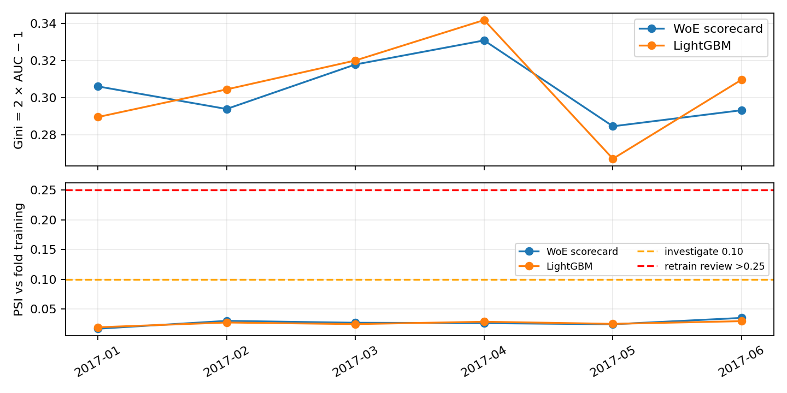

# WO-06 · 신용평가 스코어카드와 안정성 모니터링
> 개인 프로젝트 · 대응 직군: 금융 데이터 사이언티스트 · 데이터: [Lending Club granting model (Zenodo, CC BY 4.0)](https://zenodo.org/records/11295916)

## 문제 정의

신용위험 모델은 한 시점의 AUC뿐 아니라 신청 월이 바뀌었을 때의 판별력, 점수 분포, 설명 가능성을 함께 살펴야 한다. 이 프로젝트는 신청 시점 변수로 부도확률(PD)을 예측하는 WoE 로지스틱 스코어카드와 LightGBM 비교군을 만들고 월별 안정성을 검증한다. **실제 대출 심사에는 사용하지 않는다.**

## 가설

동일한 신청 시점 변수에서는 LightGBM의 판별력 이득이 작을 수 있으며, 단순한 스코어카드가 더 감사 가능한 설명을 제공한다. Gini와 PSI를 월별로 함께 보면 단일 평균 AUC가 놓치는 변동을 확인할 수 있다.

## 데이터

작업지시서의 권장 데이터인 [Home Credit Credit Risk Model Stability](https://www.kaggle.com/competitions/home-credit-credit-risk-model-stability)는 Kaggle 대회 규칙 동의가 필요해 이 실행 환경에서 내려받을 수 없었다. 대신 공개 다운로드가 가능한 [Zenodo 데이터셋](https://zenodo.org/records/11295916)(DOI 10.5281/zenodo.11295916, CC BY 4.0)을 사용했다. 원본 1,347,681건 중 2015-01~2017-06 월별 최대 1,500건씩 고정 시드로 추출하여 **45,000건**을 분석했다. 원본 CSV는 Git에서 제외하고 MD5를 확인하는 [다운로드 스크립트](data/download.sh)만 제공한다.

양성 타깃 `Default=1`은 최종 부도/상각, `0`은 전액 상환이다. 허용 피처는 `revenue`, `dti_n`, `loan_amnt`, `fico_n`, `experience_c` 다섯 가지다. ID, 신청 월, 최종 상태, 이자율/등급, 상환 및 회수 금액, 지역·우편번호·자유 텍스트는 입력에서 제외했다. **최종 상태가 실제 언제 관측됐는지는 제공되지 않아**, 검증은 사후 빈티지 비교로 해석한다.

## 접근 / 파이프라인

1. `src/data.py`: 허용 목록으로 CSV를 읽고, 월별 표본과 시간 순서 검증을 수행한다.
2. `src/models.py`: 각 학습 구간에서 `optbinning`으로 WoE/IV를 계산하고 IV ≥ 0.01 변수를 선택해 로지스틱 PD를 학습한다. 기준점 600, 기준 good/bad odds 20, PDO 50으로 점수를 환산한다.
3. 매 fold에서 스코어카드가 선택한 **동일한 피처**로 LightGBM 비교군을 학습한다. 첫 학습 구간 안의 마지막 월(2016-12)에서 Optuna 4회로 파라미터를 고른다. 튜닝 전 피처 선택은 그 월보다 앞선 자료만 사용한다.
4. 2017-01~06 각 월에 과거 신청 월만 학습하고 해당 월을 평가하는 확장 창 검증을 수행한다. AUC, `Gini = 2×AUC−1`, 학습 점수 분포 대비 PSI를 기록한다.
5. 마지막 검증 월 최고 추정 위험 사례에 Tree SHAP의 양의 default log-odds 기여도를 계산한다. 이는 **가상 수동 검토 사례**다.

재현 명령:

```bash
cd projects/wo-06-credit-scorecard
bash data/download.sh
docker compose build
docker compose run --rm test
docker compose run --rm experiment
```

실험 범위는 `WO06_START_MONTH`, `WO06_END_MONTH`, `WO06_MONTHLY_CAP` 환경변수로 바꿀 수 있다. 기본 설정의 측정 원본은 [experiment.json](results/experiment.json), 시각화는 [stability.png](results/stability.png), 전체 수치는 [report.md](results/report.md)에 있다. 최종 fold의 실제 WoE 구간·점수 기여는 [scorecard_bins.csv](results/scorecard_bins.csv), PDO 기준과 절편 점수는 [scorecard_scaling.json](results/scorecard_scaling.json)으로 확인할 수 있다.

## 결과 (Ship Gate 표)

| 지표 | 목표 | 실제 |
|---|---|---|
| 월별 Gini 및 안정성 | 시간 순서 6개월, Gini와 PSI | 2017-01~06 월별 Gini 기록. 평균 Gini 스코어카드 **0.3045**, LightGBM **0.3055**; Gini 표준편차 **0.0158 / 0.0233**; 최대 PSI **0.0349 / 0.0295** |
| 성능·설명가능성·안정성 3축 비교 | 같은 피처 기반 비교표 | 아래 표 및 [상세 결과](results/report.md) |
| 개별 거절 사유 예시 | SHAP 상위 기여 | 최고 추정 위험 신청자 PD **0.5404**; dti_n **+0.682**, loan_amnt **+0.462**, fico_n **+0.390** raw log-odds 기여. 실제 거절 아님 |
| PSI 경보 | 0.10 조사, >0.25 재학습 검토 | 실측 경보 **0건**. 인위적 분포 변화 테스트에서 `RETRAIN_REVIEW` 발생 확인 |
| 누수 방지·시간 분할 | 코드와 테스트 | 피처 허용 목록, fold 내 WoE/IV 학습, 2016-12 내부 튜닝, 월별 확장 창, 9개 테스트 통과 |

| 축 | WoE 스코어카드 | LightGBM |
|---|---|---|
| 성능 | 평균 AUC **0.6522**, Gini **0.3045** | 평균 AUC **0.6527**, Gini **0.3055** |
| 설명가능성 | 고정 구간·WoE·로지스틱 계수·PDO 점수의 가산 구조 | Tree SHAP의 사후 국소 기여; 감사 가능성은 별도 검토 필요 |
| 안정성 | Gini SD **0.0158**, 평균/최대 PSI **0.0265 / 0.0349** | Gini SD **0.0233**, 평균/최대 PSI **0.0256 / 0.0295** |



LightGBM 평균 Gini 이득 **0.0010**은 매우 작다. 이 표본에서는 스코어카드가 월별 Gini 변동이 작고 설명 구조가 단순해 우선 검토 후보로 볼 수 있지만, 신뢰구간이나 외부 검증이 없어 우월성을 결론낼 수는 없다. 두 모델의 관측 PSI는 모두 0.10 미만이다.

## 시행착오와 해결

- Home Credit 원본은 대회 접근 동의가 필요했다. 신청 월이 있고 공개 라이선스가 명시된 Zenodo 대체 자료를 택해 실제 재현 가능한 측정값을 남겼다.
- macOS 로컬 LightGBM은 `libomp.dylib`이 없어 실행되지 않았다. Docker Python 3.11 이미지에 `libgomp1`을 설치해 테스트와 전체 실험을 수행했다.
- 무작위 분할은 신청 월 순서를 섞는다. 월별 확장 창으로 바꾸고 WoE/IV 및 Optuna를 과거 학습 창 내부에만 제한했다.
- `experience_c`의 마지막 학습 창 IV가 **0.0000**이었다. 사전 정의한 IV 0.01 규칙에 따라 제외했고, 공정 비교를 위해 두 모델 모두 나머지 네 피처를 사용했다.

## 한계

최종 상환/부도 결과의 **관측 날짜가 없어** 실제 당시 사용할 수 있었던 레이블만으로 학습했는지 확인할 수 없다. 승인된 대출 중 최종 상태가 난 사례만 남아 승인 편향과 만기/검열 편향도 있다. 따라서 이 결과는 배포 가능한 PD 검증이 아니라 **사후 빈티지 비교**다. 보정도, 공정성, 신뢰구간, 법적 거절 사유 적합성은 검증하지 않았다. PSI 경보는 자동 재학습 명령이 아니라 조사 신호다. 자세한 내용은 [MODEL_RISK.md](MODEL_RISK.md)에 기록했다.

## 개발 방식 (AI 활용 구분)

| 직접 작성한 것 | Codex가 생성한 것 |
|---|---|
| SONG은 WO-06 작업지시서와 포트폴리오 목적을 제공했다. 데이터 선택·코드·측정값에 대한 개인 검토 및 최종 서술은 SONG이 이어서 수행해야 한다. | Codex가 대체 데이터 조사, 구현, Docker 재현, 테스트, 실제 실험, 시각화, 모델 리스크·인수인계 문서를 작성했다. |

## 관련 개념

PD, WoE/IV, 로지스틱 스코어카드, good/bad odds 및 PDO, 불균형 데이터의 ROC AUC/Gini, PSI, walk-forward 검증, 시간·타깃 누수, Tree SHAP, 승인 편향, 결과 관측 지연.

## English Technical Summary

Built a retrospective credit-risk scorecard on 45,000 sampled Lending Club loans across 30 origination months. A training-only WoE logistic model and a LightGBM challenger were evaluated on six expanding monthly out-of-time folds. Mean Gini was 0.3045 vs 0.3055; Gini standard deviation was 0.0158 vs 0.0233; maximum PSI was 0.0349 vs 0.0295. An allowlist excludes post-decision features, and Tree SHAP illustrates hypothetical risk contributors. Because outcome-observation dates are unavailable and only originated, resolved loans are present, these results do **not** constitute a deployable historical backtest or validated lending decision system.
