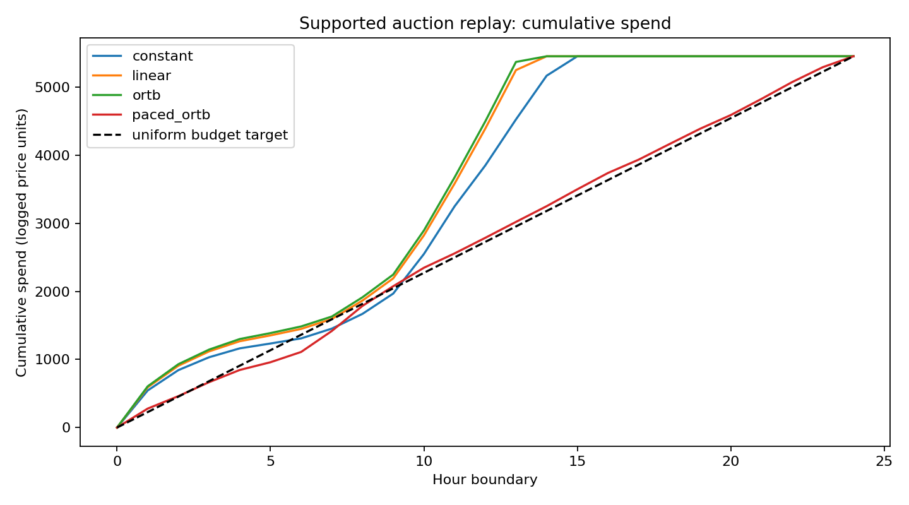
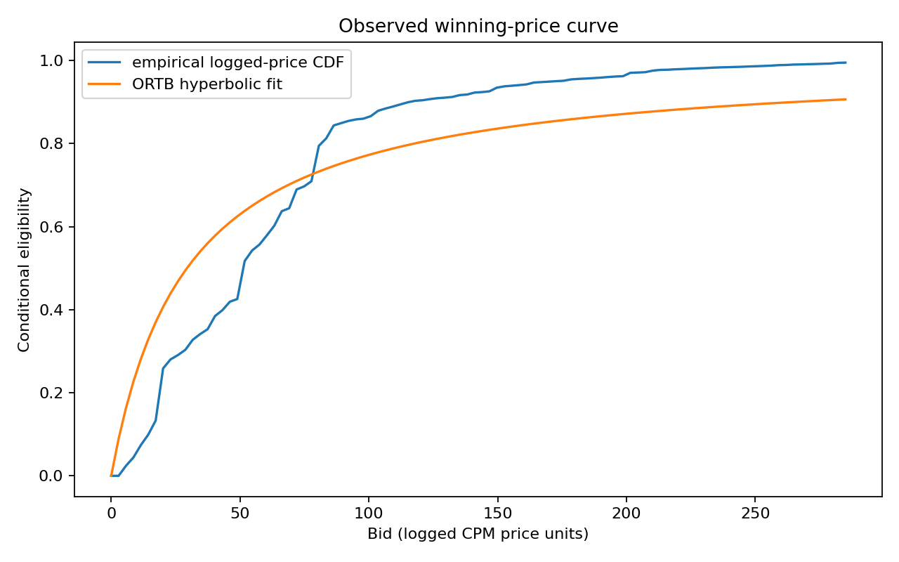

# WO-08 · RTB(실시간 입찰, Real-Time Bidding) 입찰 전략과 예산 페이싱(budget pacing)

> 개인 프로젝트 · 대응 직군: 광고 ML 엔지니어, 최적화 · 데이터: iPinYou 원본 경매 로그, 비상업 사용 조건

## 문제 정의

클릭 확률이 다른 노출 기회에 동일한 예산을 배분할 때 입찰식과 지출 속도 제어가 획득 클릭과 eCPC(유효 클릭당 비용, effective Cost Per Click)에 미치는 영향을 비교한다. 한 광고주에 대해 동일한 관측 노출 순서와 동일한 예산으로 네 정책을 재생한다.

## 가설

- pCTR(예측 클릭률, predicted CTR)에 비례한 입찰은 상수 입찰보다 예산을 클릭 가능성이 높은 노출에 집중할 수 있다.
- 낙찰가 분포를 반영한 ORTB(최적 실시간 입찰, Optimal Real-Time Bidding) 입찰은 선형 입찰과 다른 가격 선택을 만든다.
- 페이싱(pacing, 속도 조절) 제어는 누적 지출을 균등 목표선 쪽으로 이동시킬 수 있다. 클릭 개선 여부는 실제 재생 결과로 판단한다.

## 접근 — 시도 순서

1. 원 배포 경로에서 낙찰가가 포함된 원본 로그를 확인했다. 연결이 불안정해 대체 보관본을 조사했다.
2. 가공된 보관본은 낙찰가 열이 없어 경매 승패 재생에 사용할 수 없었다. 원본 `imp`와 `clk` 파일을 담은 Figshare 보관본으로 전환했다.
3. 원본 파일의 체크섬을 검증하고, 학습·보정에는 고정 크기 압축 접두 구간, 평가에는 별도 전체 로그를 사용했다. 원본 노출 로그에서 가격이 기록된 행만 관측되므로, 가상 입찰을 원래 기록된 입찰가 이하로 제한했다.
4. 상수, 선형 pCTR, ORTB, 비례 제어가 붙은 ORTB를 같은 예산으로 재생하고 클릭·지출·eCPC와 시간대별 지출을 비교했다.

## 데이터

[iPinYou 공식 데이터 설명](https://contest.ipinyou.com/data-release.html)과 [원본 필드 문서](https://contest.ipinyou.com/ipinyou-dataset.pdf)의 노출·클릭 로그를 사용한다. 파일은 [Figshare 보관본](https://figshare.com/articles/dataset/ipinyou_contest_dataset_season2/5732328)에서 내려받는다. `data/download.py`가 고정된 ZIP 바이트 범위와 SHA-256/MD5를 검증한다. 원본은 저장소에 포함하지 않는다. 사용 조건은 원 배포처의 비상업 조건을 따른다.

학습은 앞선 두 로그의 접두 구간, 확률 보정과 입찰 규모 선택은 그다음 로그의 접두 구간, 최종 평가는 마지막 전체 로그에 고정했다. 광고주 `1458`만 경매 재생 대상으로 사용하며, pCTR 학습에는 모든 광고주의 유효 행을 사용한다. 동일 BidID의 여러 클릭 이벤트는 클릭 수에 모두 반영한다.

## 파이프라인

1. `python data/download.py`로 원본 범위를 받아 체크섬을 검사한다.
2. `docker compose run --build --rm experiment`로 LightGBM pCTR 모델을 학습하고 다음 분할에서 플랫 스케일링(Platt scaling) 보정을 수행한다.
3. 학습 로그의 광고주 낙찰가에서 경험적 조건부 CDF(누적분포함수)를 구하고 `w(b)=b/(c+b)` 형태를 맞춘다.
4. 보정 분할에서 각 정책의 입찰 규모를 동일한 지출 목표에 맞춘다. 예산은 **학습 접두 구간의 관측 지출을 24개 시간대로 환산한 값의 50%**로 미리 정한다: `(3,606.389/8 + 3,661.117/8)/2 × 24 × 0.5 = 5,450.630`. 평가 로그의 지출·클릭은 예산이나 파라미터 선택에 사용하지 않는다.
5. 평가 로그를 시간 순서대로 재생한다. 가상 입찰가를 원래 입찰가로 제한하고, 가상 입찰가가 관측 낙찰가 이상이면 `낙찰가/1000`을 지출한다. 남은 예산보다 비용이 크면 낙찰하지 않는다.

상수 입찰은 `b=s`, 선형 입찰은 `b=s·pCTR/평균 pCTR`, ORTB는 `b=√(c²+c·s·pCTR/평균 pCTR)−c`를 사용한다. 페이싱 버전은 ORTB 입찰에 균등 누적 지출 목표와 실제 누적 지출의 차이로 계산한 제한된 비례 제어 배수를 곱한다.

## 결과 (Ship Gate 표)

| 지표 | 목표 | 실제 |
|---|---|---|
| 네 전략 클릭·지출·eCPC | 동일 예산 비교 | 아래 표, 예산 5,450.630 |
| 시간대별 지출 곡선 | 정책별 누적 지출 비교 | [곡선](results/hourly_spend.png), 페이싱 정책은 모든 시간대에서 지출 |
| 승률 곡선 | 관측 낙찰가 CDF와 ORTB 적합 | [곡선](results/win_curve.png), 적합 RMSE 0.114 |
| 우승 전략 분석 | 클릭·지출 근거 설명 | 상수 입찰 85클릭으로 최다, 페이싱 ORTB 83클릭 |

**측정 방식**: 기록된 낙찰 노출에서 지원 범위 내로 입찰을 낮추는 오프라인 재생. 비용 단위는 로그의 CPM(1,000회 노출당 비용, Cost Per Mille) 가격 단위를 노출당 `1/1000`로 환산했다.

| 전략 | 클릭 이벤트 | 낙찰 노출 | 소진 예산 | eCPC |
|---|---:|---:|---:|---:|
| 상수 입찰 | **85** | 126,326 | 5,450.629 | **64.125** |
| 선형 pCTR | 76 | 114,467 | 5,450.629 | 71.719 |
| ORTB | 79 | 115,497 | 5,450.628 | 68.995 |
| 페이싱 ORTB | 83 | 162,736 | 5,450.628 | 65.670 |

상수 입찰은 네 정책 중 클릭 이벤트를 가장 많이 얻었다. 페이싱 ORTB는 더 저렴한 낙찰 노출을 많이 확보해 지출을 모든 시간대에 분산했지만, 클릭은 상수 입찰보다 2회 적었다. 고정 ORTB와 선형 입찰은 평가 로그의 중간 구간에 예산을 소진했다. pCTR의 평가 AUC는 0.577이고 단일 쌍곡 승률 함수의 CDF 적합 RMSE는 0.114였다. 이 판별력과 곡선 적합 오차 아래에서 2클릭 차이를 일반적인 정책 우위로 해석하지 않는다.

## 시행착오와 의사결정

낙찰가가 빠진 가공본으로는 가상 입찰의 승패를 결정할 수 없었다. 원본 보관본을 선택한 뒤에도 실제 패배 경매의 낙찰가는 관측되지 않았다. 따라서 관측된 입찰가 이하의 정책만 평가하고, 승률 곡선도 전체 요청에 대한 승률이 아닌 **기록된 낙찰가의 조건부 누적분포**로 해석했다.

보정 구간의 지출 목표에 맞춘 선형·ORTB 입찰은 평가 구간의 트래픽 집중 구간에서 빠르게 예산을 소진했다. 비례 제어를 더하자 전 구간으로 지출이 퍼지고 낙찰 노출은 늘었지만 클릭 수는 상수 입찰을 넘지 못했다. 이후 개선 우선순위는 더 풍부한 학습 로그로 pCTR 판별력을 높이고, 계단형 낙찰가 분포에 맞는 승률 함수를 검증하는 것이다.

## 측정 경계 (한계)

- 클릭 레이블은 기록된 낙찰 노출에만 존재한다. 재생 결과는 해당 관측 집합에서 입찰을 낮췄을 때의 조건부 비교다.
- 접두 구간의 학습·보정은 전체 트래픽 분포를 대표하지 않을 수 있다. 다음 단계는 원본 전체 학습 로그와 실제 패배 로그를 포함한 지원 범위 평가다.
- ORTB 입찰식은 논문의 첫 번째 승률 함수와 입찰액 기반 비용 근사에서 출발한다. 재생은 관측 낙찰가를 비용으로 사용하므로 이 결과를 이론적 최적해로 해석하지 않는다.
- 낙찰가의 통화 환산은 검증하지 않았다. 모든 비용과 eCPC는 로그 가격 단위로 표시한다.
- 제어 목표는 균등 지출이다. 실제 시간대별 트래픽·전환가치를 아는 운영 정책은 별도 설계가 필요하다.

## 개발 방식 (AI 활용 구분)

| 직접 작성한 것 | Codex가 생성한 것 |
|---|---|
| 프로젝트 목표와 Ship Gate 지정, 결과 검토 기준 | 데이터 검증·다운로드 코드, CTR 학습·보정, 전략·재생·시각화·테스트, 실행 결과 문서 |

## 용어집

| 용어 | 뜻 |
|---|---|
| RTB (Real-Time Bidding, 실시간 입찰) | 광고 노출 기회가 생길 때마다 실시간 경매로 광고주를 정하는 거래 방식 |
| pCTR (predicted CTR, 예측 클릭률) | 모델이 예측한 특정 노출의 클릭 확률 |
| ORTB (Optimal Real-Time Bidding, 최적 실시간 입찰) | 승률 함수와 가치 신호를 결합한 입찰식. 구현은 [원 논문](https://wnzhang.net/papers/ortb-kdd.pdf)의 첫 번째 승률 함수에 대응하는 제곱근 형태를 사용한다 |
| 예산 페이싱 (Budget pacing) | 누적 지출과 목표 지출의 오차를 이용해 입찰 강도를 조절하는 속도 제어 기법 |
| eCPC (effective Cost Per Click, 유효 클릭당 비용) | 소진한 예산을 획득한 클릭 수로 나눈 값. 낮을수록 효율적이다 |
| CPM (Cost Per Mille, 1,000회 노출당 비용) | 노출 1,000회를 기준으로 한 광고 가격 단위 |
| 승률 곡선 (Win rate curve) | 특정 입찰가로 경매에서 이길 확률을 나타낸 곡선 |
| 관측 지원 범위 (Observed support) | 로그에서 결과가 실제로 확인되는 행동(입찰가) 범위. 이 범위를 벗어난 입찰은 결과를 알 수 없다 |

## English Technical Summary

This project compares constant, linear pCTR, ORTB, and paced ORTB bids under one fixed budget. A LightGBM click model is calibrated on a later partition, then the policies are replayed on held-out original iPinYou impression and click logs. Counterfactual bids are capped at the logged bid because prices and outcomes are observed only for logged winning impressions. The win curve is therefore a conditional logged-price CDF, and spend is reported in logged price units.
