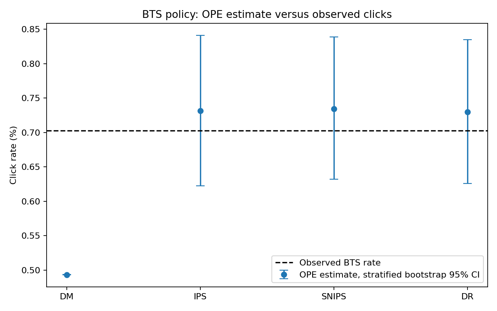
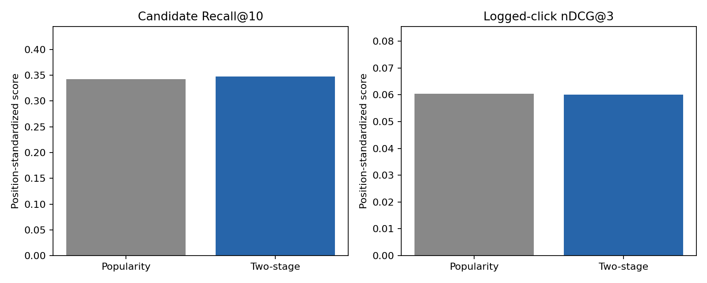

# WO-09 · 2단 추천과 오프라인 반사실 평가

> 개인 프로젝트 · 대응 직군: 추천 ML 엔지니어 · 데이터: [ZOZO Research Open Bandit Dataset](https://research.zozo.com/data.html) ([CC BY 4.0](https://huggingface.co/datasets/zozonext/open-bandit), 연구용 공개 로그)

## 문제 정의

추천 로그에는 선택된 아이템의 클릭만 관측된다. 새 추천 정책을 온라인에 적용하기 전에 클릭률을 추정하려면 기록 정책이 각 아이템을 선택한 확률과 정책 간 행동 지원 범위를 반영해야 한다. 이 프로젝트는 후보 생성→랭킹 정책을 만들고, 무작위 노출 로그에서 DM·IPS·SNIPS·DR을 비교한다. 별도 Bernoulli Thompson Sampling(BTS) 로그의 실제 클릭률로 추정량을 점검한다.

## 가설

- 인기도와 과거 클릭 친화도를 합친 후보 생성은 인기도 단독 후보보다 클릭 아이템을 더 많이 포함할 수 있다.
- 위치를 반영한 클릭 모델과 LightGBM 재정렬은 상위 3개 순위의 품질을 높일 수 있다.
- 클릭 모델의 편향이 있으면 DM이 어긋나고, IPS 보정항을 가진 DR은 실측값에 가까워질 수 있다.

## 접근 — 시도 순서

1. 공식 저장소의 소형 샘플은 Men 캠페인의 정책별 클릭 수가 적어 신뢰구간 비교에 부족했다. [원본 배포 ZIP](https://research.zozo.com/data.html)에서 Men 캠페인의 두 정책 로그만 검증해 추출했다.
2. OBP의 고정 초기 prior로 BTS 행동 확률을 재현했으나 실제 BTS 행동과의 가중 TV 거리는 **0.413**이었다. BTS 로그의 한 부분에서 클릭 레이블을 보지 않고 시간대·위치별 행동 확률을 재구성하고, 독립된 나머지 부분의 클릭을 실측값으로 사용했다. 행동 분포의 가중 TV 거리는 **0.036**으로 줄었다.
3. 위치를 제외한 클릭 모델과 위치를 포함한 모델을 비교했다. 평가 Brier 점수는 각각 **0.00561193**, **0.00561185**로 차이가 작았다. 위치를 포함한 모델도 평균 클릭 확률을 낮게 예측했고, DM은 실측 BTS 클릭률을 크게 낮게 추정했다.
4. 관측 행동 확률로 보정한 IPS·SNIPS·DR을 비교했다. DR의 절대 오차가 가장 작았지만 세 추정량의 구간이 겹쳐 단일 방법의 우월성을 주장하지 않는다. 2단 추천은 후보 Recall@10을 조금 높였고 nDCG@3은 개선하지 못했다.

## 데이터

[Open Bandit Dataset](https://research.zozo.com/data.html)의 Men 캠페인에는 아이템 34개와 노출 위치 3개가 있다. 무작위 정책 로그 **452,949건 / 클릭 2,321건**, BTS 로그 **4,077,727건 / 클릭 27,495건**을 사용한다. 무작위 정책의 기록 propensity는 모든 행에서 **1/34**이므로 평가 정책의 모든 아이템 행동에 양의 지원이 있다. 원본은 저장소에 포함하지 않으며 `data/download.py`가 ZIP 멤버 크기와 CRC를 검증한다.

무작위 로그를 시간 순으로 모델 적합 **249,121건**, 확률 보정 **67,943건**, 평가 **135,885건**으로 분리했다. 평가 클릭은 **767건**이다. 평가 기간과 일치하는 BTS 로그는 행동 확률 재구성 **609,345건**과 실측 클릭 검증 **607,536건**으로 독립 분할했다. 실측 검증 클릭은 **4,270건**이다. [원본 논문](https://arxiv.org/abs/2008.07146)과 [OBP](https://github.com/st-tech/zr-obp)를 데이터·추정량 기준으로 삼았다.

## 파이프라인

1. `docker compose run --build --rm download`로 원본 로그를 준비한다.
2. 학습 로그의 아이템 클릭률을 평활화해 인기도 후보를 만든다. 공개된 과거 클릭 친화도에서 아이템 간 동시 출현 유사도를 계산하고 인기도와 결합해 후보 10개를 선택한다.
3. 위치·사용자 범주·아이템·과거 친화도를 입력으로 하는 LightGBM 클릭 모델을 적합하고 이후 구간에서 Platt 보정을 한다. 후보를 점수순으로 재정렬해 상위 3개를 만든다. 평가 정책은 이 순위 슬레이트 95%와 균등 무작위 슬레이트 5%의 혼합이다.
4. 클릭이 기록된 무작위 노출에서 후보 Recall@10과 단일 관측 클릭 기반 nDCG@3을 계산한다. 위치별 지표를 동일 가중치로 평균한다.
5. [OBP](https://zr-obp.readthedocs.io/en/latest/estimators.html)의 DM·IPS·SNIPS·DR 점추정값을 위치별로 계산해 평균한다. 각 위치 안에서 로그 행을 **400회 재표본추출**해 95% 구간을 만들며, SNIPS는 매 재표본마다 분모를 다시 계산한다.
6. `docker compose run --build --rm experiment`로 결과를 생성하고 `docker compose run --build --rm test`로 검증한다.

## 결과 (Ship Gate 표)

| 지표 | 목표 | 실제 |
|---|---|---|
| 네 OPE 추정량과 실측 BTS 비교 | 점추정값·실측값 대조 | 아래 표, 실측 **0.7029%** |
| 추정량별 신뢰구간 | 95% 부트스트랩 | 아래 표, 위치별 400회 재표본추출 |
| 2단 추천 오프라인 지표 | Recall@10·nDCG@3 | **0.3478 / 0.0601** |
| 신뢰할 추정량 분석 | 편향·분산·지원 범위 설명 | DR의 실측 절대 오차 **0.0272%p**, IPS와 교차 확인 |

**측정 방식**: 동일 기간의 무작위 로그에서 OPE를 계산하고, 행동만으로 재구성한 BTS 정책을 독립 BTS 클릭 로그와 비교했다. 새 2단 정책은 OPE와 관측 클릭 기반 랭킹 지표로 평가했다.

| 추정량 | BTS 추정 클릭률 | 95% 부트스트랩 구간 | 실측 BTS 클릭률 | 절대 오차 |
|---|---:|---:|---:|---:|
| DM | 0.4933% | 0.4931–0.4935% | 0.7029% | 0.2096%p |
| IPS | 0.7315% | 0.6222–0.8412% | 0.7029% | 0.0287%p |
| SNIPS | 0.7340% | 0.6323–0.8387% | 0.7029% | 0.0312%p |
| DR | **0.7300%** | **0.6260–0.8349%** | 0.7029% | **0.0272%p** |

실측 BTS의 위치 균등 평균 클릭률은 **0.7029%**이고 정규근사 95% 구간은 **0.6818–0.7239%**다. DR은 DM의 낮은 보상 예측을 IPS 잔차로 보정해 네 추정량 중 실측값과 가장 가까웠다. 평가 로그의 최소 propensity는 **1/34**, BTS 비교의 최대 중요도 가중치는 **21.26**, 유효 표본 크기는 **24,456**이다. 기본 비교에서는 가중치 절단을 적용하지 않았다.

| 추천 방식 | 후보 Recall@10 | 관측 클릭 nDCG@3 |
|---|---:|---:|
| 인기도 단독 | 0.3427 | **0.0604** |
| 인기도+협업 신호 후보 → LightGBM 재정렬 | **0.3478** | 0.0601 |

새 2단 정책의 DR 클릭률 추정은 **0.6351%**(95% 구간 **0.3812–0.8741%**)다. 무작위 로그 실측은 **0.5645%**(정규근사 95% 구간 **0.5246–0.6043%**)다. 새 정책의 실제 배포 클릭률은 관측되지 않았고 구간도 넓으므로 개선을 확정하지 않는다.

## 시행착오와 의사결정

고정 prior 정책의 행동 분포 불일치를 확인한 뒤, 검증 대상 로그를 행동 확률 적합과 실제 클릭 측정으로 분리했다. 시간대·위치별 행동 복제의 가중 TV 거리는 **0.036**이고, 검증 클릭은 정책 적합에 사용하지 않았다. DM의 매우 좁은 구간은 고정된 보상 모델을 조건으로 재표본추출한 결과이므로 모델 편향을 제거하지 않는다. DR은 실측값에 가까웠고 IPS도 비슷한 결과를 제공했다.

추천 측면에서는 과거 친화도 신호가 있는 평가 문맥이 **2.61%**에 그쳤다. 후보 Recall@10은 **0.0051** 높아졌지만 최종 nDCG@3은 **0.0003** 낮았다. 후보 발견과 상위 순위 품질을 별도로 측정해야 한다는 결론에 따라 두 지표를 함께 보고한다.

## 측정 경계 (한계)

- **다음 단계**: 고정 보상 모델 조건부 부트스트랩에 모델 재적합 불확실성을 추가하고, 시간대별 정책 재구성의 잔여 오차를 민감도 분석한다.
- BTS 정확도 검증에는 목표 정책의 별도 행동 로그가 필요했다. 아직 운영되지 않은 새 2단 정책에는 이 로그가 없으므로 실측 성능 비교 대신 OPE 구간만 보고한다.
- 공개 로그에는 안정적인 사용자 ID가 없어 과거 클릭 친화도로 아이템 간 협업 신호를 구성했다. 공개 친화도가 비어 있는 문맥에서는 인기도가 후보 점수를 주도한다.
- 한 노출에 한 아이템의 클릭만 관측되므로 LightGBM은 점별 클릭 모델이고 Recall·nDCG는 관측 클릭 기반 프록시다. 전체 슬레이트의 미관측 관련성을 직접 측정하지 않는다.
- OPE는 위치별 아이템 선택의 주변 확률과 슬롯별 클릭을 다룬다. 아이템 간 슬레이트 상호작용은 별도 실험 대상으로 남긴다.
- OBP 0.5.7의 배포 메타데이터는 Python 3.11을 지원 버전으로 표시하지 않는다. 컨테이너에서 버전 검사만 우회해 설치했고, 이 조합의 실행·테스트 결과를 기록했다.

## 개발 방식 (AI 활용 구분)

| 직접 작성한 것 | Codex가 생성한 것 |
|---|---|
| 프로젝트 목표·Ship Gate·평가 범위 제시 | 데이터 검증, 후보 생성·재정렬, OPE·부트스트랩, 실행·테스트·결과 문서 |

## 관련 개념

- **Propensity와 positivity**: 기록 정책의 행동 확률과 평가 정책의 지원 범위
- **IPS / SNIPS / DR**: 중요도 재가중, 정규화, 보상 모델 잔차 보정
- **유효 표본 크기**: 중요도 가중치의 집중으로 줄어든 정보량
- **위치 표준화**: 슬롯별 클릭률을 같은 비중으로 비교
- **2단 추천**: 후보 검색으로 행동 공간을 줄인 뒤 클릭 모델로 재정렬

## English Technical Summary

This project builds a two-stage recommender and evaluates it on propensity-logged ZOZOTOWN bandit data. Popularity and historical item affinity retrieve ten candidates; a calibrated, position-aware LightGBM model reranks three items. For OPE validation, an hourly BTS policy is reconstructed from action-only target logs, while disjoint BTS clicks provide the observed reference. Position-standardized DM, IPS, SNIPS, and DR estimates are compared with stratified bootstrap intervals. DR is closest to the observed BTS click rate, while the recommender improves candidate recall but not logged-click nDCG. The new recommender has no factual deployment outcome.
