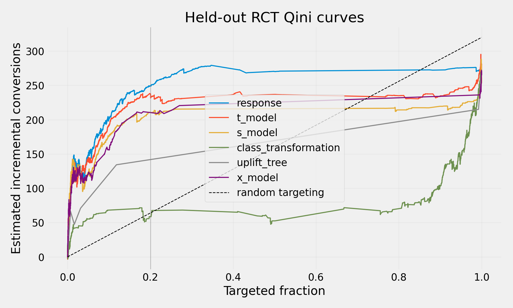

# WO-10 · 프로모션 업리프트 타기팅

> 개인 프로젝트 · 대응 직군: 데이터 사이언티스트(인과추론) · 데이터: [Criteo Uplift Prediction Dataset v2.1](https://ailab.criteo.com/criteo-uplift-prediction-dataset/) · CC BY-NC-SA 4.0

## 문제 정의

전환 확률이 높은 고객과 처치 때문에 전환할 고객은 같지 않을 수 있다. 무작위 배정 로그에서 일반 전환 예측과 처치 효과 기반 순위를 같은 타기팅 예산으로 비교한다. 원본 처치는 **광고 배정**이다. 쿠폰 비용이 있는 프로모션으로의 전이는 비용 가정을 붙인 정책 시뮬레이션으로 다룬다.

## 가설

상위 20%에게만 처치를 배정한다면 업리프트 점수로 고른 집단의 증분 전환이 전환 확률 기준선보다 높을 것이다. 같은 보류 RCT에서 Qini 계수와 처치군·대조군 전환율 차이로 검증한다.

## 접근 — 시도 순서

1. **전환 반응 기준선:** `treatment`를 입력에서 제외하고 `conversion ~ f0…f11`로 LightGBM을 학습했다. 보류 집합 Qini **0.2020**, 상위 20% 증분 전환 **290.64건**이었다.
2. **T/S 모델:** 무작위 처치군별 모델과 처치 상호작용 단일 모델을 학습했다. Qini는 각각 **0.1500**, **0.1190**이었다. 반응 확률만으로도 효과가 큰 구간을 상당히 앞쪽에 모을 수 있어 순위 가설이 그대로 성립하지 않았다.
3. **Class Transformation:** 원본 처치 비율이 약 85:15이므로 이 방식의 1:1 가정에 맞춰 학습 구간에서 두 배정군을 동일 수로 추출했다. 학습 행이 **250,722개**로 줄었고 Qini **−0.1028**을 기록했다.
4. **Uplift Tree와 X-learner:** 트리는 계산 예산 때문에 무작위 **100,000행**, X-learner는 전체 학습 구간을 사용했다. 검증 Qini가 가장 높은 업리프트 방법은 X-learner(**0.1138**)여서 이를 미리 선택했다. 보류 집합에서 X-learner Qini는 **0.1316**, 상위 20% 증분 전환은 **242.40건**이었다.
5. **정책 판단:** X-learner와 반응 기준선의 상위 20% 차이는 **−48.24건**이고, 같은 평가 행의 쌍체 부트스트랩 95% 구간은 **[−111.51, 6.26]건**이다. 기준선 대비 개선을 입증하지 못해 현재 증거로는 전환 반응 순위를 채택한다.

## 데이터

- Criteo의 누출 수정본 v2.1 원본 **13,979,592행**을 전량 스캔했다. 처치군 **11,882,655행(85.0%)**, 대조군 **2,096,937행(15.0%)**, 전환 **40,774건**이었다.
- 결과와 배정값을 보지 않고 각 행을 독립적으로 10% 확률로 뽑아 **1,397,106행**을 얻었다. 처치·전환을 층화한 학습/검증/테스트 분할은 **838,263 / 279,421 / 279,422행**이다.
- 익명 사전 특성 `f0`–`f11`만 학습에 사용했다. `treatment`는 무작위 **배정**으로 정의했고, 배정 후 실제 노출을 기록한 `exposure` 및 결과인 `visit`, `conversion`은 특성에서 제외했다.
- 표본의 특성별 처치군·대조군 최대 절대 표준화 평균 차이는 **0.0507**이었다. 처치 배정 비율 자체는 1:1이 아니며, 85:15 설계가 모델과 지표에 반영된다.
- 원본은 Git에서 제외했다. [`data/README.md`](data/README.md)의 공식 출처·다운로드 방법과 [`data/download.py`](data/download.py)를 사용한다.

## 파이프라인

```bash
python3 data/download.py
docker compose build
docker compose run --rm test
docker compose run --rm experiment
```

원본 전량 감사 → 독립 행 표본 → 층화 분할 → 학습 구간에서만 결측값 대체 규칙 계산 → 다섯 정책 학습 → 검증 Qini로 업리프트 방법 선택 → 보류 테스트에서 동일 예산 비교 순서다. 재현 가능한 수치는 [`results/metrics.json`](results/metrics.json), Qini 곡선은 [`results/qini_curve.png`](results/qini_curve.png)에 있다.

## 결과 (Ship Gate 표)

| 지표 | 목표 | 실제 |
|---|---|---|
| 반응 기준선과 업리프트 2개 이상 Qini 비교 | ≥3개 정책 | 6개 정책 비교: 반응 0.2020, T 0.1500, S 0.1190, Class Transformation −0.1028, Tree 0.0493, X 0.1316 |
| 무작위 타기팅 대비 Qini 곡선 | 그래프 | [`qini_curve.png`](results/qini_curve.png) |
| 상위 20% 증분 전환 비교 | 동일 예산 실측 | 반응 290.64건, 검증 선택 X 242.40건, 차이 −48.24건; 쌍체 95% 구간 [−111.51, 6.26] |
| persuadable 유사 그룹 특징 | 익명 피처 ≥3개 | 테스트의 20.06%; `f8` −1.697, `f9` +1.636, `f0` −0.938 표준화 평균 차이 |

**측정 방식:** 같은 무작위 배정 테스트 표본에서 선택군의 처치·대조 전환율 차이를 선택 인원으로 환산했고, 정책 간 차이 구간은 행 단위 쌍체 포아송 부트스트랩으로 계산했다.

| 정책 | 검증 Qini | 테스트 Qini | 테스트 상위 20% 증분 전환 | 정규화 순가치 대용치 |
|---|---:|---:|---:|---:|
| 반응 기준선 | 0.1800 | **0.2020** | **290.64** | **234.75** |
| T 모델 | 0.0407 | 0.1500 | 277.29 | 221.40 |
| S 모델 | 0.0674 | 0.1190 | 246.09 | 190.20 |
| Class Transformation | −0.1871 | −0.1028 | 69.05 | 13.17 |
| Uplift Tree | 0.1018 | 0.0493 | 184.30 | 128.42 |
| X-learner | **0.1138** | 0.1316 | 242.40 | 186.52 |

순가치 대용치는 전환 가치 1, 선택 인원당 처치 비용 0.001을 **가정**했다. 금전 단위가 아닌 상대 비교다.



## 시행착오와 의사결정

- **처치 비율 확인 → 방법 조정:** 원본의 85:15 배정에서 Class Transformation을 그대로 적용하면 1:1 식의 전제가 맞지 않는다. 학습 표본을 균형화했지만 대조군 수에 맞춰 정보가 줄어 성능이 낮았다.
- **Qini 검증 → 보류 평가:** 트리보다 X-learner의 검증 Qini가 높아 선택했지만 테스트에서는 T 모델의 Qini가 X보다 높았다. 방법 선택 변동성도 확인할 수 있었다.
- **업리프트 가설 → 결과 수용:** 반응 기준선의 테스트 Qini와 상위 20% 추정 효과가 모두 높았다. X와의 차이 구간은 0을 포함하므로 우월성 주장은 보류한다.
- **지표 구현 점검 → 회귀 테스트:** `uint8` 라벨을 scikit-uplift의 정규화 Qini 계산에 그대로 넘기면 산술 오버플로로 부호가 바뀌었다. 평가 입력을 `int64`로 변환하고 인공 RCT 순위 테스트를 추가했다.

## 측정 경계 (한계)

**다음 단계:** 별도 RCT나 더 큰 평가 표본으로 정책 차이의 불확실성을 줄이고, 실제 쿠폰 비용·마진·처치 설계를 넣어 금전 가치를 검증한다. 원본은 광고 배정 실험이며 비균일 10% 표본의 건수를 전체 사용자 수로 직접 외삽하지 않는다.

네 분면은 개인의 잠재결과를 둘 다 관측해 붙인 정답이 아니다. T 모델의 `p0`, `p1`과 검증 집합 경계값으로 정의한 **모델 암시 유사 그룹**이다. persuadable 유사 그룹의 테스트 비중 **20.06%**와 익명 피처 차이는 설명용이다. 이 그룹의 실측 처치 효과는 **270.56건 [156.38, 384.74]**이지만, sleeping-dog 유사 그룹의 실측 효과는 **43.13건 [−21.70, 107.95]**으로 예측 부호와 맞는다고 단정할 수 없다. 익명 피처에는 사업상 의미를 임의로 붙이지 않는다.

## 개발 방식 (AI 활용 구분)

| 직접 작성한 것 | Codex가 생성한 것 |
|---|---|
| 작업지시서의 문제 정의·증명 목표·Ship Gate·데이터 출처 | 데이터 감사·모델 학습·평가 코드, 테스트, 그림, 실측 결과와 문서 초안 |

결과 해석과 최종 공개 문구는 원본 측정 파일과 비교해 검토할 수 있도록 분리해 두었다.

## 관련 개념

- **ITT:** 무작위 `treatment` 배정에 따른 평균 전환율 차이. 실제 노출 `exposure`를 처치로 바꾸지 않는다.
- **Qini:** 예측 효과 순으로 사용자를 선택할 때 누적 증분 전환이 무작위 순위보다 얼마나 앞서는지 나타낸다.
- **정책 가치:** 동일 예산의 선택군에서 `선택 인원 × (처치 전환율 − 대조 전환율)`로 증분 전환을 추정한다.
- **잠재결과:** 한 개인에게 처치와 비처치를 동시에 관측할 수 없어 네 인과 유형의 실제 개인 레이블은 알 수 없다.

## English Technical Summary

Using the corrected Criteo randomized ad-assignment dataset, I compared a response model with T-, S-, class-transformation, uplift-tree, and X-learner policies on the same held-out sample. The response model reached a Qini coefficient of 0.2020 and an estimated 290.64 incremental conversions at a 20% targeting budget. The validation-selected X-learner reached 0.1316 and 242.40; the paired policy difference was −48.24 conversions with a 95% bootstrap interval of [−111.51, 6.26]. The experiment therefore does not establish an uplift-policy improvement over response targeting. Segment labels are model-implied proxies, and the advertising treatment is distinct from an actual coupon offer.
