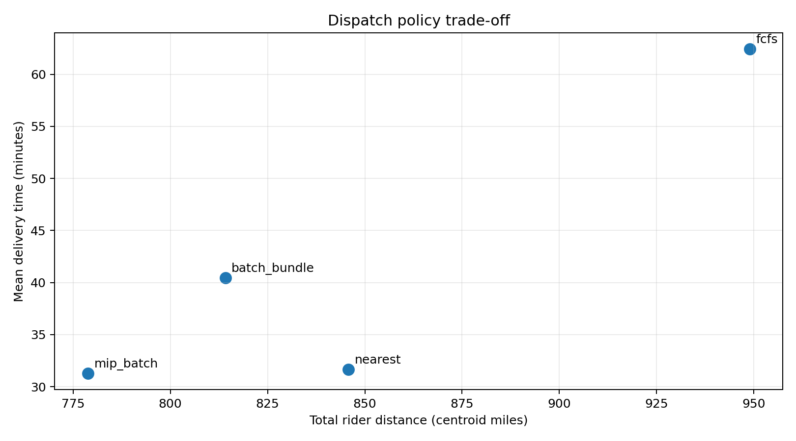
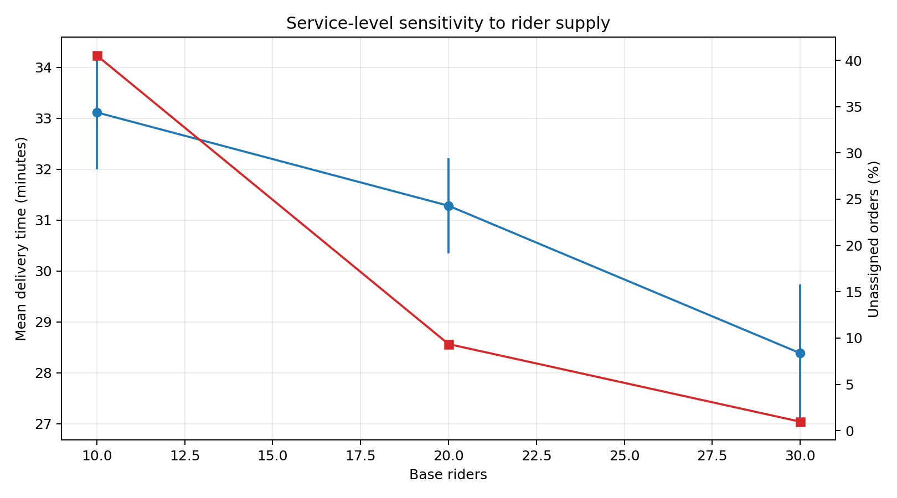
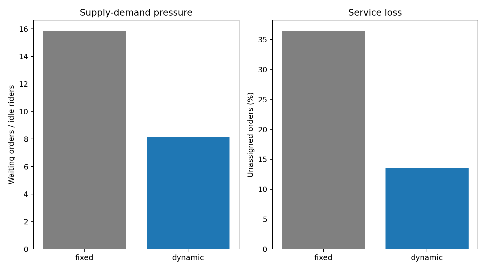

# WO-11 · 배달 배차 OR 시뮬레이터

> 개인 프로젝트 · 대응 직군: ML/OR 데이터 사이언티스트 · 데이터: [Solomon VRPTW/SINTEF](https://www.sintef.no/projectweb/top/vrptw/100-customers/) 공개 학술 벤치마크, [NYC TLC Trip Record](https://www.nyc.gov/site/tlc/about/tlc-trip-record-data.page)·NYC Open Data 이용 조건

## 문제 정의

주문이 순차적으로 도착하는 배달 운영에서 라이더를 누구에게 배정하고, 언제 배치를 모으며, 두 주문을 묶을지를 결정한다. 정적 VRPTW에서는 차량 용량과 고객 시간창을 지키면서 차량 수와 이동거리를 줄이고, 동적 운영에서는 배달시간·이동거리·미배차율의 교환관계를 관리해야 한다.

## 가설

1. 시간창·용량을 함께 보는 OR-Tools 탐색은 최근접 고객 탐욕법보다 Solomon 기준해에 가까울 것이다.
2. 실시간 최근접 배차는 FCFS보다 지연을 줄이고, 배치 최적화와 묶음배달은 대기시간을 대가로 이동 효율을 높일 것이다.
3. 공급 부족에서는 가격 신호에 따른 수요 조정과 예비 라이더 유입이 수급 압력과 미배차율을 낮출 것이다.

## 접근 — 시도 순서

1. **최근접 VRPTW 기준선:** 현재 위치에서 용량·시간창을 지키는 가장 가까운 고객을 이어 붙였다. 세 인스턴스 모두 실행 가능했지만 공개 기준보다 차량을 4~10대 더 사용했고 거리는 91.18~147.25% 길었다.
2. **차량 수 고정 OR-Tools 탐색:** Solomon의 계층 목적과 맞추기 위해 공개 기준 차량 수를 고정하고 Guided Local Search를 제한 시간 동안 실행했다. 최초 후보 `C103`은 실행 가능한 초기해를 만들지 못해, 같은 공식 C1 계열에서 실행 가능해와 비영 gap을 함께 확인할 수 있는 `C101`, `C104`, `C107`로 검증 집합을 바꿨다. 거리 gap은 0.00%, 9.02%, 3.06%였다.
3. **실시간 정책:** SimPy에서 FCFS와 최근접 라이더를 1분 주기로 비교했다. 최근접은 FCFS 대비 평균 배달시간을 62.41분에서 31.66분으로 낮추고 미배차율을 34.99%에서 8.61%로 낮췄다.
4. **배치 정책:** 5분마다 두 주문 묶음 또는 CP-SAT 최소비용 매칭을 실행했다. MIP 배치는 최근접보다 총 이동거리가 7.92% 짧고 평균 배달시간도 유사했지만 미배차율은 0.74%p 높았다. 묶음 정책은 완료 주문의 81.48%를 묶어 미배차율을 7.98%로 낮췄지만 평균 배달시간은 40.44분으로 증가했다.
5. **수급 정책:** 공급 부족 조건에서 가격 배율이 수요를 일부 억제하고 예비 라이더를 유입시킨다는 명시적 탄력성 가정을 적용했다. 평균 활성 라이더는 10.00명에서 13.87명, 생성 주문은 200.08건에서 168.50건으로 바뀌었고 미배차율은 36.41%에서 13.56%로 감소했다.

## 데이터

- Solomon 100-customer VRPTW 원본에서 고객 좌표·수요·시간창·서비스시간과 차량 용량을 읽었다. 공개 기준은 차량 수 우선, 이중 정밀도 총거리 차선의 계층 목적이다.
- 고정된 NYC TLC Yellow Taxi 월별 Parquet **2,964,624행**을 전량 검사했다. 시간·거리·Taxi Zone이 유효한 **2,836,371행**에서 라벨과 무관한 확률 표본 **47,641행**을 만들었다.
- Taxi Zone 공식 도형의 대표점을 사용해 OD 위치를 만들고, 원본의 시간대별 도착량과 실제 운행시간 분포를 합성 주문 생성에 사용했다. 원본 택시 승차를 실제 배달 주문으로 해석하지 않는다.
- 다운로드 URL, 원본 크기, SHA-256은 [`DATA_VALIDATION.md`](DATA_VALIDATION.md)에 기록했고 원본은 Git에서 제외했다.

## 파이프라인

```bash
python data/download.py
docker compose build
docker compose run --rm test
docker compose run --rm experiment
```

```text
Solomon 원본 ──> 파서 ──> 제약 검증 ──> Greedy / OR-Tools ──> 공개 기준 gap
NYC TLC 원본 ──> 유효성 검사 ──> 시간·OD·운행시간 분포 ──> 합성 주문
합성 주문 ──> SimPy ──> FCFS / 최근접 / 묶음 배치 / MIP 배치
                    └─> 라이더 민감도 / 동적 가격 / 반복 실행 95% CI
```

Solomon 시간창은 하드 제약으로 검증한다. 동적 운영에서는 30분 대기 한도를 넘긴 주문을 미배차로 처리하는 소프트 서비스 정책을 사용한다. 각 확률적 조건은 동일한 seed 집합으로 12회 반복했다.

## 결과 (Ship Gate 표)

| 지표 | 목표 | 실제 |
|---|---|---|
| Solomon 공개 기준 gap | 3개 이상 | C101 0.00%, C104 9.02%, C107 3.06% |
| Greedy vs OR-Tools 거리·경로시간 | 비교표 | 세 인스턴스 모두 거리·총 경로시간 감소, 아래 표 |
| 4개 배차 정책 비교 | 배달시간·가동률·미배차율 | FCFS/최근접/묶음 배치/MIP 배치, 12회 평균·95% CI |
| 실시간 vs 배치 | 지연·효율 교환관계 | 최근접 31.66분·845.81마일, MIP 배치 31.28분·778.80마일 |
| 라이더 민감도 | 10/20/30명 | 미배차율 40.53% / 9.35% / 0.97% |
| 동적 가격 전후 수급 | 고정 vs 동적 | 수급 압력 15.84→8.14, 미배차율 36.41%→13.56% |
| 시뮬레이션 불확실성 | 반복·신뢰구간 | 모든 핵심 지표 12회 반복, t 기반 95% CI |

**측정 방식:** Solomon은 공식 100-customer 원본과 SINTEF 공개 기준을 사용했고, 정책 평가는 TLC 분포 기반 합성 주문을 SimPy에서 동일 seed로 반복했다. 거리는 Taxi Zone 대표점 직선거리, 단건 운행시간은 TLC 관측 분포다.

### Solomon 검증

| 인스턴스 | 공개 기준 차량/거리 | Greedy 차량/거리 | OR-Tools 차량/거리 | OR-Tools gap | Greedy/OR-Tools 총 경로시간 |
|---|---:|---:|---:|---:|---:|
| C101 | 10 / 828.94 | 20 / 1628.43 | 10 / 828.94 | 0.00% | 18148.52 / 9828.94 |
| C104 | 10 / 824.78 | 14 / 1576.79 | 10 / 899.16 | 9.02% | 14703.14 / 10139.18 |
| C107 | 10 / 828.94 | 17 / 2049.59 | 10 / 854.31 | 3.06% | 14811.34 / 9997.55 |

Greedy 거리 gap은 각각 96.45%, 91.18%, 147.25%지만 차량 수도 공개 기준보다 많다. 차량 수 우선인 계층 목적에서는 거리 비교 이전에 이미 열위다. OR-Tools RoutingModel 결과는 제한 시간 내 메타휴리스틱 해이며, `C101`의 0.00%는 공개 거리 반올림값을 재현했다는 뜻이다.

### 정책 비교

| 정책 | 평균 배달시간, 분 (95% CI) | 가동률 | 미배차율 (95% CI) | 총 이동거리 | 묶음 비율 |
|---|---:|---:|---:|---:|---:|
| FCFS | 62.41 [60.96, 63.86] | 98.69% | 34.99% [30.23, 39.75] | 948.91 | 0.00% |
| 최근접 실시간 | 31.66 [30.55, 32.77] | 96.31% | 8.61% [6.94, 10.28] | 845.81 | 0.00% |
| 묶음 배치 | 40.44 [38.75, 42.12] | 91.63% | **7.98%** [6.24, 9.71] | 814.14 | 81.48% |
| MIP 배치 | **31.28** [30.35, 32.22] | 89.03% | 9.35% [7.00, 11.70] | **778.80** | 0.00% |



### 라이더 수 민감도와 동적 가격

| 라이더 수 | 평균 배달시간, 분 (95% CI) | 미배차율 (95% CI) | 가동률 |
|---:|---:|---:|---:|
| 10 | 33.11 [32.00, 34.23] | 40.53% [38.13, 42.92] | 88.01% |
| 20 | 31.28 [30.35, 32.22] | 9.35% [7.00, 11.70] | 89.03% |
| 30 | 28.39 [27.04, 29.73] | 0.97% [0.12, 1.81] | 71.66% |



| 가격 정책 | 생성 주문 | 평균 활성 라이더 | 평균 가격 배율 | 수급 압력 | 미배차율 (95% CI) |
|---|---:|---:|---:|---:|---:|
| 고정 | 200.08 | 10.00 | 1.000 | 15.84 | 36.41% [33.37, 39.44] |
| 동적 | 168.50 | 13.87 | 1.677 | 8.14 | 13.56% [10.73, 16.39] |



## 시행착오와 의사결정

- **단순 최근접 → 계층 목적 확인:** 탐욕법은 모든 고객을 방문했지만 더 많은 차량을 썼다. Solomon 기준과 맞추기 위해 공개 차량 수를 고정한 뒤 거리 gap을 계산했다.
- **`C103` 초기해 실패 → 검증 집합 수정:** 제한 시간만 늘리는 방식으로는 초기 실행 가능해가 생기지 않았다. 실패 조건을 유지한 채 공식 C1 인스턴스 중 실행 가능해를 반복 재현하는 세 문제를 선택했다.
- **정적 최적화 → 동적 운영:** VRPTW 거리만으로 정책을 고르면 주문 도착 대기와 라이더 유휴를 설명할 수 없다. SimPy 이벤트와 주문 만료를 추가해 배달시간·가동률·미배차율을 함께 측정했다.
- **배치 효율 → 서비스 지연 확인:** MIP 배치는 가장 짧은 거리를 냈지만 5분 배차 주기 때문에 미배차율이 실시간 최근접보다 높았다. 묶음은 처리량을 높였지만 배송시간을 늘렸다.
- **가격 효과 → 구성요소 분리:** 미배차율 개선을 가격 자체의 인과 효과로 표현하지 않고, 수요 탄력성과 예비 라이더 공급 탄력성을 적용한 시나리오 결과로 한정했다.

## 측정 경계 (한계)

**다음 단계:** 도로망 이동시간, 음식 준비시간, 라이더 수락 확률, 실제 배달 로그로 수요·공급 탄력성을 추정하고 rolling-horizon pickup-and-delivery VRP로 묶음 경로를 재최적화한다.

Taxi Zone 대표점 거리는 실제 도로거리가 아니며, 동적 가격 계수는 정책 민감도를 보기 위한 가정이다. OR-Tools VRPTW는 제한 시간 메타휴리스틱이고, MIP 배차는 각 배치 시점의 단건 이분 매칭을 정확히 푼다. 따라서 전체 동적 운영의 전역 최적성을 뜻하지 않는다.

## 개발 방식 (AI 활용 구분)

| 직접 작성한 것 | Codex가 생성한 것 |
|---|---|
| 작업지시서의 문제 정의·증명 목표·Ship Gate·데이터 출처 | 원본 검증, VRPTW 파서·제약 검사, 휴리스틱·OR-Tools·SimPy 구현, 반복 실험, 시각화와 문서 초안 |

원시 반복값과 집계 수치는 [`results/report.json`](results/report.json), 표는 [`results/`](results/)의 CSV에 남겨 공개 서술을 독립적으로 검산할 수 있다.

## 관련 개념

- **VRPTW:** 차량 용량과 고객별 서비스 가능 시간창을 지키는 차량경로문제다.
- **계층 목적:** Solomon 비교에서는 차량 수를 먼저 최소화하고, 같은 차량 수에서 총거리를 최소화한다.
- **이산사건 시뮬레이션:** 주문 도착·배차·픽업·배달 완료가 발생할 때 시스템 상태를 갱신한다.
- **배치 매칭:** 주문을 짧게 모아 공동 최적화하면 이동 효율이 좋아질 수 있지만 대기 지연이 생긴다.
- **신뢰구간:** 한 번의 난수 실행 대신 독립 seed 반복의 평균 불확실성을 나타낸다.

## English Technical Summary

I implemented a constrained VRPTW benchmark and a dynamic dispatch simulator. On three 100-customer Solomon instances, a fixed-fleet OR-Tools guided local search produced distance gaps of 0.00%, 9.02%, and 3.06% against SINTEF reference values, while a feasible nearest-neighbor baseline used four to ten extra vehicles. In 12-replication SimPy experiments driven by NYC TLC temporal and OD distributions, real-time nearest dispatch reduced mean delivery time from 62.41 to 31.66 minutes versus FCFS. Five-minute exact batch matching reduced centroid distance to 778.80 from 845.81 for real-time nearest dispatch, with a 0.74 percentage-point increase in unassigned orders. The pricing scenario explicitly combines assumed demand elasticity and reserve-rider supply response; it is a sensitivity experiment rather than a causal estimate.
